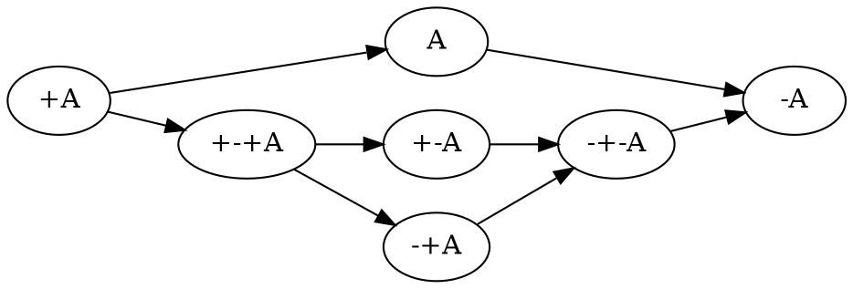

---
math:
  '\dobs': '\mathbf{d}_\text{obs}'
  '\dpred': '\mathbf{d}_\text{pred}\left( #1 \right)'
  '\mref': '\mathbf{m}_\text{ref}'
  '\rule': '\dfrac{\displaystyle ~~#1~~ }{\displaystyle ~~#2~~ } \  (#3)'
  '\defeq': '\overset{\text{def}}{=}'
  '\with': '\mathbin{\mathrm{\&}}'
  '\par': '\mathbin{\mathrm{⅋}}'
  '\multimapboth': '\mathbin{\mathrm{⧟}}'
  '\bang': '{\mathrm{!}}'
  '\whim': '{\mathrm{?}}'
  '\ocin': '\mathrel{\raise{-1pt}{\mathrm{!}}\mathord{\in}}'
  '\sk': '{\color{mygray} #1}}'
---

\definecolor{mygray}{RGB}{156,156,156}

# Logic

The Curry-Howard correspondence maps logic to programming. A logical system specifies well-formed proofs of propositions. These correspond to well-formed programs in a simple type system. By proving the logic sound and complete, we get an expressive programming language.

## Logic style

The use of sequent calculus is inspired by {cite}`downenSequentCalculusCompiler2016`. The alternative would be natural deduction. In natural deduction, conceptually every proposition is a sequent of the form $\vdash A$ (a "proof" or "theorem" to use the [classification of sequents] terminology). For example the law of excluded middle $A, \neg A \vdash$ is written $\vdash (A \otimes \neg A) \to \bot$. We could thus say that every natural deduction sequent has one "slot", in the right. In sequent calculus we instead allow sequents to have multiple or no slots, left slots and right slots. The mapping between natural deduction and sequent calculus is thus one of converting connectives to slots and vice-versa.

Whereas a natural deduction logic results in reduction patterns similar to the lambda-calculus, sequent calculus divides the program into values and continuations. Reduction always takes place at a cut point with a value and a continuation. Continuations are exposed as first-class manipulable variables, similar to CPS, but as discussed in IR, CPS-based IRs have drawbacks that sequent calculus-style IRs do not. I think this cut-reduction semantics makes a lot more sense than allowing arbitrary reductions anywhere.

Between classical, intuitionistic, and linear logic, I went with linear logic. It's the most expressive, in that intuitionistic and classical logic can be encoded fairly naturally, but linear logic has more operators. Intuitionistic logic is traditional and has a direct machine implementation, but there is an operational semantics for linear logic {cite}`mackieGeometryInteractionMachine1995` and linear logic makes the expensive "copy term" operation more explicit. In intuitionistic logic, copying can happen anywhere in the reduction, which is harder to handle. The "boxes" of linear logic which demarcate copying boundaries are supposedly the basis of optimal reduction {cite}`guerriniTheoreticalPracticalIssues1996`.

There are also other logics similar to Girard's linear logic, like deep inference. Most papers on deep inference seem to add the [mix rule](https://ncatlab.org/nlab/show/mix+rule) which corresponds to assuming $1 \leftrightarrow \bot$. This doesn't seem attractive compared to plain linear logic - it proves contradiction as a theorem, hence loses the embedding of classical logic. [This page](https://www.pls-lab.org/en/Mix_rule) mentions that mix holds in various models of linear logic such as coherent spaces and the game-theoretic semantics, but models are usually a simplification and there are models such as the syntactic model where mix doesn't hold. {cite}`strassburgerDeepInferenceExpansion2019` presents a deep inference system for non-mix MLL but says extending it to full LL is future work.

There is also the question of if, having removed weakening and contraction, the remaining structural rules, exchange and associativity, should be dropped. Linear logic gives the idea of the propositions being in named slots, as e.g. $\vdash A^a, B^b`$ is for almost all purposes the same as $\vdash B^b, A^a`$, and only in some narrow cases would we want to differentiate them. This associative array semantics corresponds well to the RAM model. In contrast, dropping exchange gives non-commutative or ordered logic, leading to a stack or list on each side. But {cite}`shiVirtualMachineShowdown2005` shows that a register model is much better for an implementation - the extra stack swapping instructions are more overhead than the additional register names. Stack-like access is just too restrictive. Similarly, dropping associativity gives a tree-like semantics, and trees are not iterable in constant time. The number of operators would explode because every tree structure / stack index would create a new operator. Hence linear logic is the clear winner. But, there seem to be reasonable ways of embedding linear logic in non-associative / non-commutative logic by adding associative / commutative modalities. {cite}`blaisdellNonassociativeNoncommutativeMultimodal2022` If there was a popular logic with such an embedding, then we could switch from linear logic to that. But per {cite}`millerOverviewLinearLogic2004` "no single [non-commutative] proposal seems to be canonical at this point."

{cite}`downenSequentCalculusCompiler2016` say "Sequent Core lies in between \[intuitionistic and classical logic\]: sometimes there can only be one conclusion, and sometimes there can be many." Specifically, terms and types are intuitionistic (single conclusion), but commands, continuations and bindings are written to allow multiple propositions. Ret/Ax, WR/Name, and Jump/Label all introduce right-weakening. Linear logic seems a lot cleaner than this mess, but also lies between intuitionistic and classical logic, in that (like intuitionistic) there is no excluded middle, but also (like classical) there is duality and no limitation on the number of conclusions.

Linear logic can be formulated as two-sided, one-sided, or intuitionistic. I chose two-sided because again, it's the most expressive. The two-sided sequent formulation preserves intent, e.g. the definition of proofs as sequents $\vdash A$ is lost in the one-sided calculus as everything is of that form. Taking the two-sided logic as basic, the one sided logic can be formulated as a transformation that moves everything to the right side with negation and pushes down negations to atomic statements by applying duality. Such a transformation is of course useful, but forcing it to be applied from the start does not seem to serve much purpose. Intuitionistic logic doesn't have negation - it has to be encoded as $A \to \bot$, pretty bad for trying to simplify connectives.

There is one advantage to one-sided, namely it reduces the number of positions, so the representation in code goes from two arrays of formulas/slots to one. But the one-sided logic still has dual connectives - for example an application of identity of par looks like $\vdash A \par B, A^\bot \otimes B^\bot$ instead of $A \par B \vdash A \par B$. So we also should combine dual connectives, by adding a flag for polarity. But then we might as well adding a boolean for side as well, to recover the two-sided sequent logic. So we could represent a rule as (connective,polarity,side), where polarity is positive or negative, side is left or right, and the connectives themselves are unpolarized and unsided. This is how they are presented in the reference: the propositions are on the left and right of the sequent, and each connective is annotated with plus or minus. The only minor constraint of this notation is that to preserve the mapping back to a two-sided sequent, left propositions must be listed before right propositions. But this is fine since the list of sequent propositions is otherwise unordered. We can omit the polarity/side in the rule bodies (propositions) and infer it back from the polarity/side listed in the rule and the slot mappings.

But polarity+side is not quite canonical as we have for example that the rule $𝕁^+_L$ is the same structure as $𝕁^-_R$, and similarly $𝕁^-_L$ is the same as $𝕁^+_R$. In the compiler, we would like to only have one datatype alternative for each rule structure, and then have a flag for distinguishing the remaining side/polarity bit. Looking at the rules:

- Class 1:

  - J+R/J-L is a data constructor or function application
  - !+R/!-L is a box
  - Q+R/Q-L is also pretty much a box

- Class 2:

  - !d-R/!d+L is an accessor, and weakening/contraction follow similar structure
  - J-R/J+L is a case statement
  - Q-R/Q+L is substituting a value in a derivation at the type level

Per ChatGPT, we can classify these as "build"/"break", thus getting our desired bit. Actually we will use specific rule names most of the time, so we don't need the bit. Then we can use the side as the second bit (as that is syntactic and easier to read from a sequent than polarity).

## Type annotations

In {cite}`downenSequentCalculusCompiler2016`, TyApp is written in natural deduction style. Actually, it seeems type annotations just sort of float around, they should not be part of the sequents at all. In my presentation of logic, terms are the proof trees, and propositions the types. So when it is written that ∀ and ∃ consume terms with types, like ∀R $(\Gamma, a : \kappa \to v : \tau) \vdash (\Gamma \to \Lambda a : \kappa. v : \forall a : \kappa . \tau)$, $a : \kappa$ is just an assertion, and I would instead just write $(\Gamma \to \tau) \vdash (\Gamma \to \forall a : \kappa . \tau)$, where $a$ has no free occurrence in $\Gamma$ and is ambiently assumed to be of some type. Stroscot is a unityped language, so the types can just be ignored for now.

## Jumbo connective

Based on {cite}`levyJumboLcalculus2006`, Stroscot aims for the largest allowable set of operators. In particular we have one connective, the "jumbo" $𝕁$ (double-struck capital J, decided per ChatGPT), which comes in two polarities $𝕁^+$ and $𝕁^-$. $𝕁^+$ is positive, and on the left (input) side it is data, like Levy's $\Sigma$ tuple rule. $𝕁^-$ is negative, and on the right acts like Levy's $\Pi$ function rule. In both cases though they are more general, allowing multiple conclusions, dualization, and other features of linear logic. Each $𝕁$ variant is defined relative to a case structure, like $𝕁 [(a, [A_{11},A_{12}] \vdash [B_{a1}]),(b, [A_{b1}] \vdash []), (c,[]-[B_{c1}])]$ We have a list of labels, $l_i, 1 \leq i \leq N$, and each label has left and right sequent propositions $A_{ij}$ and $B_{ik}$ where $1 \leq j \leq m_i, 1 \leq k \leq n_i$. Following Levy, we call $N$ the length of the jumbo type and the list $[(m_i,n_i)]$ the jumbo-arity.

In {cite}`downenSequentCalculusCompiler2016`, TLK/TRK correspond to an intuitionistic-style one-sided $𝕁^+$ operator. But they have no corresponding $𝕁^-$ operator, but rather Case/Deflt, which have no effect on the sequent type, hence no logical meaning. They say they considered adding "general existential types" which seems to be a $𝕁^-$ operator in disguise, but mapping to GHC Core was too difficult and required a "heavy-handed encoding". Since Stroscot is a new language, we can have a full set of jumbo operators to do all sorts of case-matching.

When the RHS of $𝕁^+$ is nonempty we get terms with holes, that can be pattern-matched by filling the holes, e.g. [difference lists](https://en.wikipedia.org/wiki/Difference_list). (TODO: check that this actually gives efficient concatenation)

The dual of implication is called "subtraction" or "difference" and is denoted $-$. For an ADT, the RHS of the difference is empty, i.e. `a A | b B1 B2 | C` looks like . This follows {cite}`wadlerCallbyvalueDualCallbyname2003` and {cite}`crolardFormulaeastypesInterpretationSubtractive2004` but is flipped compared to Pi's implication.

The jumbo connectives have the nice "unpacking" property that any combination of $𝕁^+$ connectives is equivalent to a single $𝕁^+$ connective, and likewise for $𝕁^-$.

The index $i$ in Levy's presentation is a tag drawn from a finite subset of a countable set of labels. But we can draw it from a subset of the universal set and hence get dependent types that depend on terms. In particular $𝕁^-$ gives a dependent function type and $𝕁^+$ gives a dependent pair type.

## Common connectives

Girard chose his notation mainly for convenience, in particular he avoided the common symbols of logical connectives so that he didn't have to mark classical logical connectives vs. linear logic connectives. Since Stroscot only uses one logic style, we aren't limited by such considerations.

Per the structure-preserving "plethoric" translation in {cite}`dicosmoIntroductionLinearLogic2015`, section 2.1, PDF page 30, the linear logic operators that correspond to intuitionistic logic's conjunction/disjunction are the additive binary connectives, Girard's $\with$ and $\oplus$. Girard's notation doesn't express their duality at all so it has to be replaced. Per Wikipedia, the customary symbols are $\land / \lor$, programming uses $\with / \vert$, and there is also the electronics notation $\cdot / +$. ChatGPT says $\land / \lor$ is 80% of usage so that's what I went with.

For $\otimes$, it is a [tensor/monoidal product](https://en.wikipedia.org/wiki/Monoidal_category) so the symbol is natural. Technically $\par$ is a tensor product too, but the fact that tuples are typically positive data leads us to privilege one over the other. And it agrees with Girard, although I think he chose $\otimes$ to go with $\oplus$.

$\par$ is the dual of $\otimes$ in the sense that $A \par B \equiv \neg (\neg A \otimes \neg B)$; unfortunately for deciding a notation, this seems to be its only useful property. Looking at the literature, $\oplus, \odot ,\Box,\sharp, \bullet$ and $*$ have meanings (direct sum/coproduct, Hadamard product/XNOR gate/symmetric product, modal operator, music, multiplication/logical and, convolution) dissimilar from the function of $\par$. $\mathbin{{\scriptstyle+}\mkern-0.522em\raise{-0.077em}{\diamond}},\mathbin{{\vee}\mkern-0.815em\raise{0.09em}{\bigcirc}}$ don't have Unicode symbols so are hard to use. In the end none of the operators seems particularly evocative. $\par$ on the other hand redirects to linear logic on Wikipedia. So again we follow Girard.

Then we have the units for each of these connectives. I'm most confident in my choice of $\bot$ as the unit for $\par$. It is usually used for denoting the absurdity derived from a contradiction, and indeed we can prove $A, \neg A \vdash \bot$ and $\neg A \equiv A \to \bot$ starting from the identity rule. It also agrees with Girard.

For the unit of the tensor product, it's the standard unit type in programming, so `()` is a possibility, but in the math-style semantics the unit type is traditionally represented as $\mathbb{1}$, matching Girard. I went with an unstyled $1$ for ease of input. Another choice would be the tee symbol $\top$ to be the dual of $\bot$, but this conflicts with Girard's usage of that symbol.

The units of $\lor / \land$ are logical false / logical true. Looking at choices, $\bot / \top$ is out because $\bot$ is already taken. IMO it's pretty confusing that in Girard's notation $\bot$ is not the dual of $\top$. $0/1$ is pretty common, but conflicts with using $1$ for the unit of $\otimes$. $T/F$ is clear enough and doesn't conflict, so that's what I went with.

The negations and shifts show up in polarized / focused linear logic. We use the convention that an up shift raises a negative to positive (increases the value, hence points up). This is the original definition of [Girard's](https://www.seas.upenn.edu/~sweirich/types/archive/1991/msg00123.html), `P = up N`. More recent papers such as {cite}`girardLocusSolumRules2001` and {cite}`zeilbergerLogicalBasisEvaluation2009` seem to have lost this convention and use definitions of up-shift and down-shift reversed from ours. {cite}`nigamAlgorithmicSpecificationsLinear2009` uses an alternate notation of delay operators $\delta^\pm(\cdot)$ instead of shifts.

### Programming types

With the programming types we see the justification for the jumbo types: they can represent abstract data types (ADTs). Even though we can encode $𝕁$ using the common connectives:

$$
𝕁^- [(\#t_1,[A_{1,1},A_{1,2},\ldots] \vdash [B_{1,1},B_{1,2},\ldots]),\ldots] \equiv (\smash{\stackrel{-}{\neg}} A_{1,1} \par \smash{\stackrel{-}{\neg}} A_{1,2} \par \ldots \par B_{1,1} \par \ldots) \land \ldots

𝕁^+ [(\#t_1,[A_{1,1},A_{1,2},\ldots] \vdash [B_{1,1},B_{1,2},\ldots]),\ldots] \equiv (A_{1,1} \otimes A_{1,2} \otimes \ldots \otimes \smash{\stackrel{+}{\neg}} B_{1,1} \otimes \ldots) \lor \ldots
$$

With the encoding, we lose the free-form tags and have to use strings like "RRRRRL". This leads to unbalanced proof trees and a general lack of expressiveness of the proof language.

Lambdas have several conflicting definitions, so I have left them out. {cite}`maraistCallbynameCallbyvalueCallbyneed1995` says call by name lambdas are $\Omega_N = \bang^+ \Omega_N \to \Omega_N$, and call by value lambdas are $\Omega_V = \bang^+ (\Omega_V \to \Omega_V)$. {cite}`filinskiLinearContinuations1992` agrees on call by name lambdas, but says call by value lambdas are $\Omega_V = \bang^+ (\Omega_V \to \bang^- \Omega_V)$. A paper I forgot to cite points out that most of these expand to the same infinite type so are equivalent, making me wonder if these types actually represent differing reduction strategies at all.

## Exponential

The exponential is an S4 modality. Again it comes in two polarities. These are usually written ! (bang/"of course", positive) and ? (whim/whimper/"why not", negative) but to make polarity explicit we write $\bang^+$ (equivalent to !) and $\bang^-$ (equivalent to ?). ! was chosen as the base symbol because use of ? is rather rare.

### Contraction

Instead of binary contraction we allow $n$-ary contraction for $n\geq 2$. This is equivalent to binary contraction but makes the proof trees a little more compact.

### Subexponentials

Standard linear logic only contains bang and whim. But per {cite}`nigamAlgorithmicSpecificationsLinear2009` these are not "canonical" - if we introduce two modalities $\bang_1, \bang_2$ with distinct but identical rules, we cannot prove $\bang_1 A \equiv \bang_2 A$. So in keeping with the maximalist approach we present here the logic with subexponentials. The subexponentials function as annotations on exponentials, in that we can erase all the subexponential labels to a single standard exponential, and we can infer subexponential labels, computing the minimal subexponential structure necessary for the program to work. Subexponentials whose only operations are promotion/dereliction can be deleted from the program. {cite}`danosStructureExponentialsUncovering1993`

For notation, there's a lot of choices. I propose $\bang^\pm_S$ (with $S = (m,x) \in (M,X)$), where $m$ is in an index set $M$ and $x \in X, X = P(\{c, w\})$. $\bang^\pm$ are the well-known full exponentials $m=\cdot,x=\{c,w,d\}$, as is standard.

To use these we must define a relation $\leq$ on $(M,X)$ such that $((M,X),\leq)$ is a poset and satisfies two more requirements:

1. $(m,x) \leq (n,y)$ implies $x\subseteq y$.
2. if $x \subseteq y$, then $(m,x) \leq (m,y)$ for all $m$.

Justifying these:

- Reflexivity ensures the identity theorem.
- Transitivity and the first requirement ensure cut elimination.
- Antisymmetry ensures that if $\bang^+_M A \equiv \bang^+_N A$ then $m=n$ and $x=y$, so that we do not have duplicate notation for a particular modality.
- The second requirement is not strictly necessary, but makes the notation more coherent. If it is not satisfied we can simply split the index $m$ into two or more indexes $m_i$.

The rule for promotion requires that $Z \leq M_i$ and $Z \leq N_i$ for the elements of the context.

```{math}

\begin{array}{cc}
  \rule{\overrightarrow{\bang^+_{M_i} \Gamma_i } \vdash A, \overrightarrow{\bang^{-}_{N_i}\Delta_i} }{\overrightarrow{\bang^{+}_{M_i} \Gamma_i } \vdash \bang^{+}_Z A, \overrightarrow{\bang^{-}_{N_i}\Delta_i}}{\bang^+}
  &
  \rule{\overrightarrow{\bang^+_{M_i} \Gamma_i }, A \vdash \overrightarrow{\bang^{-}_{N_i}\Delta_i} }{\overrightarrow{\bang^{+}_{M_i} \Gamma_i } ,\bang^{-}_Z A \vdash \overrightarrow{\bang^{-}_{N_i}\Delta_i}}{\bang^-}
\end{array}
```

Dereliction is allowed unconditionally, so that the identity rule holds.

```{math}

\begin{array}{cc}
  \rule{\sk{\Gamma}, A \vdash \sk{\Delta} }{\sk{\Gamma}, \bang^+_M A \vdash \sk{\Delta}}{\bang^+ d}
& \rule{\sk{\Gamma} \vdash A, \sk{\Delta} }{\sk{\Gamma} \vdash \bang^-_M A, \sk{\Delta}}{\bang^- d}
\end{array}
```

Weakening requires $w \in \text{snd} M$.

```{math}

\begin{array}{cc}
    \rule{\sk{\Gamma} \vdash \sk{\Delta} }{\sk{\Gamma}, \bang^+_M A \vdash \sk{\Delta}}{\bang^+ w}
  & \rule{\sk{\Gamma} \vdash \sk{\Delta} }{\sk{\Gamma} \vdash \bang^-_M A, \sk{\Delta}}{\bang^- w}
  \end{array}
```

Contraction requires $c \in \text{snd} M$

```{math}

\begin{array}{cc}
    \rule{\sk{\Gamma}, \overrightarrow{\bang^+_M A, \bang^+_M A, \cdots} \vdash \sk{\Delta} }{\sk{\Gamma}, \bang^+_M A \vdash \sk{\Delta}}{\bang^+ c}
  & \rule{\sk{\Gamma} \vdash \overrightarrow{\bang^-_M A, \bang^-_M A, \cdots}, \sk{\Delta} }{\sk{\Gamma} \vdash \bang^-_M A, \sk{\Delta}}{\bang^- c}
\end{array}
```

We also allow quantification over subexponentials, as in {cite}`nigamAlgorithmicSpecificationsLinear2009`.

### Modalities

Because of the equivalences $\bang^\pm \bang^\pm A \equiv \bang^\pm A, \bang^\pm \bang^\mp \bang^\pm \bang^\mp A \equiv \bang^\pm \bang^\mp A$, there are only 7 modalities created from combining exponentials. They have the relationships as follows, where an arrow $A \to B$ means $\vdash A \to B$ is provable: {cite}`coniglioEqualityLinearLogic2002`



More generally with subexponentials:

- For $M \geq N$, $\bang^+_M \bang^+_N A \equiv \bang^+_M A \equiv \bang^+_N \bang^+_M A$, and identically with $\bang^-$.
- For $N \leq P$ and $O \leq M$ we can prove $\bang^+_M \bang^-_N \bang^+_O \bang^-_P A \equiv \bang^+_M \bang^-_P A$.

With distinguished subexponentials the possible modalities become infinite, for example alternating patterns like $\bang_1 \bang_2 \bang_1 \bang_2$ cannot be simplified unless there is a relation in the poset between 1 and 2. But of course if we erase the index labels then $\bang \bang \bang \bang A \equiv \bang A$. Due to this, I think keeping the "well-known" subexponentials in the IR is fine and informative, but distinguished subexponentials should be avoided except during a pass that reduces exponential strength and eliminates unnecessary exponentials.

## Classification of sequents

{cite}`downenSequentCalculusCompiler2016` splits the space of sequents into four sets: commands $\Gamma \vdash \Delta$, terms $\Gamma \vdash \tau$, continuations $\Gamma, \tau \vdash \Delta$, and bindings $\Gamma, \Delta' \vdash \Gamma', \Delta$ (noting that $\mid$ is synonymous with ","). These clearly overlap, and the restrictions on what can be used where seem arbitrary.

It seems easier to follow {cite}`lafontLinearLogicPages` and classify proofs by properties of their sequent:

- $\vdash A$ is a proof of $A$. $A$ is said to be a theorem or tautology. The theorem $\vdash A \leftrightarrow B$ shows equivalence $A\equiv B$.
- $A \vdash$ or $A \vdash \bot$ is a refutation of $A$. $A$ is said to be an absurdity.
- $\Gamma \vdash$ or $\Gamma \vdash \bot$ derives a contradiction from $\Gamma$
- $x, \ldots, z \vdash A$, where $x,\ldots,z$ are free variables representing propositions (most likely appearing in $A$), is a proof pattern of $A$. Similarly $x, \ldots, z, A \vdash$ is a refutation pattern.
- $\Gamma \vdash A$ is a term with result type $A$

$𝕁^+_R$ constructs a proof from a collection of proofs and refutations, while $𝕁^-_L$ constructs a refutation from a collection of proofs and refutations.

## Polarized logic

Following {cite}`lafontLinearLogicPages` we say a proposition $A$ is positive if $A \equiv \bang^+ A$. Dually we say $A$ is negative if $A \equiv \bang^- A$. $A$ is positive iff $\neg A$ is negative, and vice-versa.

The direction $\bang^+ A \vdash A$ is trivial by dereliction, so when considering a specific proposition we only must show $A \vdash \bang^+ A$.

In general, $𝕁^+ [ \vec A_i \vdash \vec B_i]$ is positive, and $𝕁^- [ \vec A_i \vdash \vec B_i ]$ is negative, if $A_i$ are all positive and $B_i$ are all negative, hence the assignment of plus and minus for $𝕁$.

Going through the rules on $A \vdash \bang^+ A$:

- $F,1$ are positive
- $\bang^+ A$ is positive for any $A$
- $A \lor B,A \otimes B$ are positive if $A,B$ are positive
- $T,\bot$ are not positive
- $A \land B$ is positive if $A$ is positive and $\bang^+ A \vdash B$, e.g. if $B$ is a theorem
- $A \par \bot$ is positive if $A$ is positive. More generally, $A \par B$ is positive if $A$ is positive, $B \vdash \bot$ (i.e., $B$ is a refutation), and $A\vdash A,B$.

We say that a proposition is polarized if it is either positive or negative. Unpolarized propositions such as $T \otimes \bot$ exist, although every tautology is positive and every absurdity is negative. By strong consistency, no proposition can be both negative and positive.

Girard defined a syntactic rather than semantic notion of polarity, based on classifying connectives. By his definitions, $A \par \bot$ and $A\otimes 1$ remove polarity from a positive resp. negative proposition. But the semantic definition seems more useful.

Lafont also defines regular types $A \equiv \bang^- \bang^+ A$, but considering that there are 6 non-trivial modalities including a dual modality $\bang^+ \bang^-$ this seems too limited. There is not a clear justification for this definition; maybe some paper in the literature explains it, but a simple search "regular linear logic" didn't uncover it.

### Cartesian types

{cite}`filinskiLinearContinuations1992` observes in section 3.1 that, even in the absence of exponentials, we can actually copy and discard data of certain "cartesian" types in a linear fashion. This is quite similar to positivity. However, positivity is not necessary or sufficient to be cartesian - $BB = \text{Bool} \to \text{Bool}$ is positive, but the proof does not actually make a copy of the function, because it can only evaluate the function at one value. Also, as exponentials are non-canonical, per {cite}`lafontLinearLogicPages` a formula $C = \alpha \otimes \bang(\alpha \ to \alpha \otimes \alpha) \otimes \bang(\alpha \to 1)$ can be copied and discarded but does not satisfy $C \vdash \bang \alpha$ hence is not positive.

Formally, cartesian types are defined as commutative co-monoids. In terms of sequent proofs, this means we have a
proposition $A$, with theorems $w : A \vdash 1$ and $c : A \vdash A \otimes A$. There are then 3 laws that these theorems must satisfy, equivalences under cut elimination:

- unit:

$$
\rule{c : A \vdash A \otimes A \quad (w \otimes \text{id}) : A \otimes A \vdash A \otimes 1}{A \vdash A \otimes 1}{\text{cut}} = \rule{\text{id} : A \vdash A \quad \vdash 1}{A \vdash A\otimes 1}{\otimes_R}
$$

- commutativity:

$$
\rule{c : A \vdash A \otimes A \quad swap : A_1 \otimes A_2 \vdash A_2 \otimes A_1}{A \vdash A \otimes A}{\text{cut}} = \text{c} : A \vdash A \otimes A
$$

- associativity:

$$
\rule{c : A \vdash A \otimes A \quad (id \otimes c) : A \otimes A \vdash A \otimes (A \otimes A) \quad A\otimes (B \otimes C) \vdash (A \otimes B) \otimes C}{A \vdash (A\otimes A) \otimes A}{\text{cut x2}} = \rule{c : A \vdash A \otimes A \quad (c \otimes id) : A \otimes A \vdash (A \otimes A) \otimes A}{A \vdash (A\otimes A) \otimes A}{\text{cut}}
$$

In addition, Filinski adds uniqueness: $w : A \vdash 1$ and $c : A \vdash A \otimes A$ must each have only one unique cut-free proof.

We can similarly define co-cartesian types $A$ that can be copied and discarded on the right with theorems $w : 1 \vdash A$ and $c : A \otimes A \vdash A$ and are a commutative monoid.

I'm not sure if there is a simple description of all cartesian types, but of course $\bang^\pm$ are cartesian/co-cartesian, and $𝕁^+ [ \vec A_i \vdash \vec B_i]$ and and $𝕁^- [ \vec A_i \vdash \vec B_i ]$ are cartesian/co-cartesian if $A_i$ are all cartesian and $B_i$ are all co-cartesian. So ADTs in general - booleans, integers, lists, trees - are all cartesian. Our earlier example $C$ is in general not cartesian because, although copy and discard can be proven, it uses the included functions and those won't necessarily satisfy the laws.

Filinski says in 3.2 that all cartesian types are positive. Hence, for cartesian / co-cartesian types, because the proof of polarity is natural, we can be generous with exponentials and use them whenever we have such a type, without fear of changing the program semantics. This allows a more faithful representation of copy operations in the proof structure, avoiding implicit copying such as `\x -> case x of True -> (True,True); False -> (False,False)`.

But, if we start with a plethoric translation to begin with and only remove unnecessary exponentials, probably cartesian types don't matter, because all the copy operations are explicitly represented using exponentials to begin with.

### Tangent: Reversible computing

Another approach to duplication is "superstructural reversible logic" {cite}`sparksSuperstructuralReversibleLogic2014`. In their calculus, duplicating any type (cartesian or not) is impossible, without using non-reversible rules. The non-reversible structural rules could be restricted to a modality similarly to how linear logic restricts contraction/weakening. But in Theseus {cite}`jamesTheseusHighLevel2014` and even in the latest publication {cite}`chenComputationalInterpretationCompact2021` they use standard higher-order functions to do most of the programming. So really a reversible program is a data type `Rev`, similar to how a normal program is a data type `Task`. The difference is that `Rev` contains isomorphisms rather than continuations.

In terms of support, I don't think there's much needed at present. With the DSL support Stroscot should be able to write isomorphisms similar to Theseus, and run them forwards/backwards like the [Agda code](https://github.com/DreamLinuxer/popl21-artifact). Once there is hardware/an ISA/an OS to target it should be straightforward to extend this basic support to a compiler.

## Structural rules

As is usual for linear logic there are no structural rules for weakening or contraction (they are restricted to the exponentials above). And in Core we use a graph representation that internalizes the exchange rule, so there is not really an exchange rule either.

The cut rule is technically a theorem; we can prove that any proof using cut can be reformulated to be cut-free. But the expansion may result in exponentially more rule applications.

Similarly the identity rule is a theorem for propositional logic: we can produce a proof tree for $A \vdash A$ for any finite proposition $A$ via expansion of all the cases. Using the identity rule speeds up reduction because it skips iterating through the structure, and it also allows manipulating (prefixes of) {ref}`infinite <infinite>` trees.

## Quantifiers

To move from propositional to first-order logic we must extend the identity rule to allow terms. Some presentations call the identity rule "ax", for identity axiom, but in general the identity rule is a theorem so this seems foolish. Instead we call it "id".

We explicitly list the identity theorem where it is needed:

- [nLab](https://ncatlab.org/nlab/show/sequent+calculus) defines a substitution rule/theorem. There is a theorem that substitution rules can be eliminated from the proof tree, proven by taking the proof tree for $\Gamma \vdash \Delta$ and replacing all its identities $x \vdash x$ with identities $t \vdash t$. This requires $t \vdash t$ to hold, hence we include it. If the identity rule is not used with `x` in the proof tree, then the identity rule is not needed for the substitution, but such a situation is unlikely.
- Quantifiers also require the identity rule, because cut elimination applies substitution of `x` for `t` in the proof tree where `x` is a variable.

Cut elimination for quantifiers is sound because the number of quantifiers in the sequent decreases.

The assignment of $\forall$ as positive is logical, based on analogy with $\bang^+$. For example, we can prove $A \vdash \bang^+ \forall x. A$ for closed positive propositions $A$. This is shown as a cut on the assumption $A \vdash \bang^+ A$ and on the easily provable $\bang^+ A \vdash \bang^+ \forall x. A$

## Logic translations

First we must define classical and intuitionistic logic. To define classical logic we simply add standard structural weakening and contraction rules to our linear logic. Then $A\otimes B \equiv A \land B$, $A\par B \equiv A \lor B$, and we obtain the usual classical logic with modalities {cite}`lafontLinearLogicPages`; all the connectives decompose into or are equivalent to the standard ones. To define intuitionistic logic we take classical logic and restrict the right hand side of all sequents to have at most one consequent; various pi/sigma connectives cannot be used as they would create multiple consequents, and similarly right contraction cannot be used. We allow disallow right weakening to make the translation easier.

The translation $[\cdot]_I$ from intuitionistic logic to linear logic decorates every proposition and subproposition with !. {cite}`dicosmoIntroductionLinearLogic2015`

$$
\left[\mathop{𝕁^-} \limits_{i} \left(\overrightarrow{A_i} \multimap \overrightarrow{B_i}\right)\right]_I &= \prod \limits_{i} \left(\overrightarrow{\bang\left[A_i\right]_I} \multimap \overrightarrow{\bang\left[B_i\right]_I}\right)

\left[\mathop{𝕁^+} \limits_{i} \left(\overrightarrow{A_i} - \overrightarrow{B_i}\right)\right]_I &= \sum \limits_{i} \left(\overrightarrow{\bang\left[A_i\right]_I} - \overrightarrow{\bang\left[B_i\right]_I}\right)
$$

We can translate classical logic into intuitionistic logic by decorating every proposition and subproposition with $\neg\neg$ and moving the right to the left with another negation, i.e. $\Gamma \vdash \Delta \Rightarrow \Gamma', \neg \Delta' \vdash$. Thus the translation of classical logic into linear logic decorates like $\neg \bang^+ (\neg \bang^+ A) \equiv \bang^- \bang^+ A$.

These two decoration translations preserve proof structure, in the sense that every intuitionistic/classical proof tree can be converted to a linear logic proof tree, and the reverse as well if the linear logic proof tree's sequent is the result of the proposition translation. There are other "uniform" translations, like in {cite}`danosStructureExponentialsUncovering1993`, but they aren't as simple.

## Definitions

I didn't find any relevant papers on defining new notation for expressions in the sequent calculus. So we have to prove consistency ourselves. But I think the cut elimination theorem poses no problem, the key and commutative cases are trivial.

The identity rule fails if the notation expands via an infinite chain of definitions $A_1 = \ldots A_2 \ldots, A_2 = \ldots A_3 \ldots = \ldots$. For example for Russell's paradox and the related $\{x : x \in x\}  \in \{x : x \in x\} = \{x : x \in x\}  \in \{x : x \in x\} = \ldots$. Hence we exclude such circular definitions by requiring the identity theorem to complete for all notations.

For the substitution theorem goes through with the same restriction on notation. The proof works by replacing variable identities $x \vdash x$ with more complex identities $A \vdash A$.

Non-circularity is a pretty loose restriction. If we know a definition is size-decreasing, we can induct as usual to prove the identity theorem: use the basic identity theorem on non-definition subtrees, use the definition rule on both sides for each definition, and continue switching between the two until it's built up. Hence we only have to be careful for definitions like sets that can increase size when expanded.

## Set theory

The naive set theory definition comes from {cite}`shirahataLinearSetTheory1994` (page 10). The rest of the definitions are similar to the ones in {cite}`shulmanLinearLogicConstructive2018` except $\in$ is not affirmative.

(paradoxes)=

### Paradoxes

It seems from playing with some examples that forbidding circular definitions is sufficient to prevent Russell's paradox and Curry's paradox. For example with $R = \{x\mid \bang^- \neg(x \in x)\}$, $\{x\mid F \} \in R$ is defined (and provable) but $R \in R$ is circular hence not defined. So we cannot write the premise of Russell's paradox. We could try to work around this with a proposition like $t\in R \land t= R$. This is not circular, but it is not sufficient to derive a paradox, as in order to apply contraction we have to use a substitution that produces $R \in R$. Curry's paradox $X=\{x\mid x\in x \to Y\}$ similarly contains $x\in x$ and hence the notation $X \in X$ is circular and therefore forbidden as well.

More formally, suppose the logic is inconsistent, i.e. there is a derivation $\vdash \bot$. This must be derived from the empty sequent. Then what does cut elimination do? Either it completes, in which case we get a contradiction because no rule derives the empty sequent, or there's some infinite chain of cut elimination. I claim the infinite chain only happens if there is a circular definition involved and the identity or substitution rules are on the sides. Hence, forbidding circular definitions in the identity and cut rules solves the issue.

The question of whether a given set comprehension is defined is undecidable, as we can encode the lambda calculus and hence the halting problem - the beta rule $(\lambda x. A) t$ does the same substitution as $t\in\{x\mid A\}$. We can approximate definedness with a termination checking algorithm, type system, or syntactic check:

- Strict comprehension, i.e. the bound variable can only appear once in the formula {cite}`shirahataLinearSetTheory1998` Very restrictive.
- New Foundations's stratified formulas {cite}`forsterQuineNewFoundations2019` {cite}`holmesElementarySetTheory1998` NFU + Infinity + Choice is known to be consistent with the theory of types with the Axiom of Infinity, and is a subtheory of ZFC + "there is an n-Mahlo cardinal for each concrete natural number n". But the stratification is restrictive, e.g. we cannot define a set of sets that contain themselves even though this definition is well-founded.
- Hindley-Milner type inference (since the simply typed lambda calculus terminates). Seems like a reasonable check.
- A size-checking algorithm like in {cite}`jonesCallbyvalueTerminationUntyped2008`. Seems to have unpredictable behavior, but may solve some things HM can't.
- Brute-force expansion. Also somewhat unpredictable.
- Intersection type system. Typeable iff terminating, but undecidable in general and tricky to approximate. But should be strictly better than HM.

There is also {cite}`shirahataLinearConservativeExtension1996` which allows sets built from ZF's axioms.

### Equality

The axioms of reflexivity, substitution, etc. can take a variety of modalities as in {cite}`coniglioEqualityLinearLogic2002`, some of them corresponding with intuitionistic and classical notions of equality. For sets we use linear weak extensional equality. Alternatively we could use intuitionistic equality $A\overset{!}{=}B \defeq !(A=B)$, then substitution is $A\overset{!}{=}B, \phi \vdash \phi[A/B]$. But the linear equality seems more useful.

Proof of the substitution property: For $𝕁^-$ we use the right rule to split into cases for each tag, then we use contraction/weakening on $\bang(A=B)$ to match the number of A's/B's in the case, then the left rule to split into each A and B, giving each branch a copy of the hypothesis. $𝕁^+$ is similar but with the left first. For exponentials, quantifiers, and set comprehension we simply do left/right in the correct order. Then at the end we use the hypothesis to change $A[x/a]$ on the left or right to $B[x/b]$, or else weakening to remove the hypothesis followed by the identity.

## Recursion and infinite structures

Steelman 7B. It shall be possible to call functions and procedures recursively.

There is the question of representing recursion, as standard derivations only allow finite (well-founded) proofs.Sequent Core {cite}`downenSequentCalculusCompiler2016` introduces Let/MultiCut and Rec, which "serve two purposes: to give a shared name to the result of some computation, and to express (mutual) recursion."

$$
\begin{array}{cc}
  \rule
    {\Gamma, \Theta \vdash \Delta, \Lambda \quad \Gamma', \Lambda \vdash \Theta, \Delta' }
    {\Gamma, \Gamma' \vdash \Delta, \Delta' }{\text{multicut}}
  &
  \rule
    { \overrightarrow{\Gamma, \vec \Lambda, \Theta_i \vdash \Lambda_i, \vec \Theta, \Delta }}
    {\Gamma, \overrightarrow{\Theta_i} \vdash \overrightarrow{\Lambda_i}, \Delta }{\text{rec}}
\end{array}
$$

But these rules are illogical and inadmissible. For example with Let/MultiCut, one can conclude from $A,B \vdash B,C$ and $A,B \vdash B,C$ (provable via Ax) that $A \vdash C$. Similarly Rec concludes from $A,B,C,D \vdash B, D, E, F$ and $A,B,C,E \vdash C, D, E, F$ (again provable via Ax) that $A,D,E \vdash B,C,F$.

Alternately let can be encoded as a record and recursion via a fixed-point combinator or a cycle in the graph. In particular {cite}`kiselyovManyFacesFixedpoint2013` outline a polyvariadic combinator:

```
fix_poly fl = fix (\self -> map ($ self) fl)
```

To implement `fix` we can use the variant of the Y combinator $\lambda f.(\lambda x.x x) (\lambda x.f (x x))$. To type it we need the cyclic/recursive type $Wr = 𝕁^-[(^w, Wr, r)]$ (in the sense of an infinite, regular tree). BOHM uses a fan/duplication node combined with a loop.

A better method, following {cite}`jonesImplementationFunctionalProgramming1987` chapter 12, is to simply allow (regular) infinite proof trees. We construct "infinite" as a terminal coalgebra - our proof trees turn into fixed points of systems of formal equations {cite}`karazerisFinalCoalgebrasAccessible2011`, as opposed to actually being infinite. We represent the system of equations explicitly with the use-def rules, which also allow naming computations. Although the regular restriction means we can't represent some values directly such as the Fibonacci sequence, most of the types we care about are regular, like the lambda calculus or lists, and similarly some infinite values like `x = 1 : x`.

Infinite structures can be paradoxical, e.g. we can prove $\vdash\bot$ using cut on the proposition $A=\neg A$. Cut elimination will often fail to complete, but there is a progress property in the sense that the cut can always be pushed down and eliminate an identity rule or two matching logical rules.

## Confluent reduction

Reduction (cut-elimination) of our linear logic trees is not confluent, but only because of commuting cuts. If we drop the black sequent parent-child edges, and only consider proof nets, then the system is confluent. A cut only interacts with other cuts at identity rules, but with a cut-identity-cut pattern it doesn't matter which cut reduces with the identity. (TODO: prove this formally)

## Levels

For the implementation of optimal reduction we can add level indices to the terms in the promotion and dereliction rules of $\bang$, as in {cite}`martiniFineStructureExponential1995` and {cite}`guerriniTheoreticalPracticalIssues1996`. Conceptually all terms have indices, but we can recover the indices in a proof tree by propagating the indices from the promotion/dereliction rules up/down according to the criteria that the indices involved in all non-$\bang$ promotion/dereliction rules must be the same.

To handle level indices in infinite trees, we store the difference function `\a -> a + (j-i)` and recover the levels by tracing from the root of the derivation tree (which is always level 0) and applying the difference function when encountered.

The level of a context is the maximum of the levels of its terms, 0 if it is empty.

$$
\begin{array}{ccc}
  \rule{\bang^+\Gamma^i \vdash A^j, \bang^-\Delta^i }{\bang^+\Gamma^i \vdash \bang^+ A^i, \bang^-\Delta^i}{\bang^+}_{j = i+1}
  & \rule{\sk{\Gamma^i}, A^i \vdash \sk{\Delta^i} }{\sk{\Gamma^i}, \bang^+ A^j \vdash \sk{\Delta^i}}{\bang^+ d}_{j\leq i}
  & \rule{\sk{\Gamma}, \overrightarrow{\bang^+ A, \bang^+ A, \cdots} \vdash \sk{\Delta} }{\sk{\Gamma}, \bang^+ A \vdash \sk{\Delta}}{\bang^+ c_n}
\end{array}
$$

$$
\begin{array}{ccc}
  \rule{\bang^+\Gamma^i, A^j \vdash \bang^-\Delta^i }{\bang^+\Gamma^i, \bang^- A^i \vdash \bang^-\Delta^i}{\bang^-}_{j = i+1}
  & \rule{\sk{\Gamma^i} \vdash A^i, \sk{\Delta^i} }{\sk{\Gamma^i} \vdash \bang^- A^j, \sk{\Delta^i}}{\bang^- d}_{j \leq i}
  & \rule{\sk{\Gamma} \vdash \overrightarrow{\bang^- A, \bang^- A, \cdots}, \sk{\Delta} }{\sk{\Gamma} \vdash \bang^- A, \sk{\Delta}}{\bang^- c_n}
\end{array}
$$

To handle level mismatches we might also need lifting operators. The conditions are unclear.

$$
\begin{array}{cc}
  \rule{\Gamma^i \vdash A^j, \Delta^i }{\Gamma^i \vdash A^i, \Delta^i}{\text{lift}_R}_{j > i}
  &
  \rule{\Gamma^i, A^j \vdash \Delta^i }{\Gamma^i, A^i \vdash \Delta^i}{\text{lift}_L}_{j > i}
\end{array}
$$

In practice I have had trouble interpreting these levels operationally, it seems the levels have no relationship to actual optimal reduction.

---
math:
  '\rule': '{ \dfrac{\displaystyle ~~#1~~ }{\displaystyle ~~#2~~ } \  (#3)}'
  '\defeq': '{\overset{\text{def}}{=}}'
  '\with': '{\mathbin{\mathrm{\&}}}'
  '\par': '{\mathbin{\mathrm{⅋}}}'
  '\multimapboth': '{\mathbin{\mathrm{⧟}}}'
  '\bang': '{{\mathrm{!}^+}}'
  '\whim': '{{\mathrm{!}^-}}'
  '\ocin': '{\mathrel{\raise{-1pt}{\mathrm{!}}\mathord{\in}}}'
  '\sk': '{{\color{mygray} #1}}'
---

mygray}{RGB}{156,156,156}
# Logic

The logic for Stroscot is based on a two-sided linear logic sequent calculus.

## Jumbo connectives

```{math}

\begin{array}{cc}
\rule{\overrightarrow{ \Gamma, \overrightarrow{A_{i j}} \vdash \overrightarrow{B_{i k}}, \Delta }}
  {\Gamma \vdash \mathop{𝕁^-} \limits_{i} \left(\overrightarrow{A_i} \vdash \overrightarrow{B_i}\right), \Delta }
  {𝕁^-_R}
&
\rule{\overrightarrow{ \sk{\Gamma_j} \vdash A_{i j}, \sk{\Delta_j} } \quad \overrightarrow{ \sk{\Theta_k}, B_{i k} \vdash \sk{\Lambda_k} }}
  {\sk{\overrightarrow{\Gamma}}, \sk{\vec \Theta}, \mathop{𝕁^-} \limits_{i} \left(\overrightarrow{A_i} \vdash \overrightarrow{B_i}\right) \vdash \sk{\overrightarrow{\Delta}}, \sk{\vec\Lambda}}
  {𝕁^-_{L} {}_{i}}
\end{array}
```

```{math}

\begin{array}{cc}
\rule{\overrightarrow{ \sk{\Theta_j} \vdash A_{i j}, \sk{\Lambda_j} } \quad \overrightarrow{ \sk{\Gamma_k}, B_{i k} \vdash \sk{\Delta_k} }}
  {\sk{\overrightarrow{\Gamma}}, \sk{\overrightarrow{\Theta}} \vdash \mathop{𝕁^+} \limits_{i} \left( \overrightarrow{A_i} \vdash \overrightarrow{B_i} \right), \sk{\overrightarrow{\Delta}}, \sk{\overrightarrow{\Lambda}}}
  {𝕁^+_{R} {}_{i}}
&
\rule{\overrightarrow{ \Gamma, \overrightarrow{A_{i j}} \vdash \overrightarrow{B_{i k}}, \Delta } }
  {\Gamma, \mathop{𝕁^+} \limits_{i} \left ( \overrightarrow{A_i} \vdash \overrightarrow{B_i} \right ) \vdash \Delta }
  {𝕁^+_L}
\end{array}
```

### Common connectives

All of the standard operators 01⊕⊗⊤⊥&⅋⊸⧟ in linear logic can be expressed using $𝕁^+$ and $𝕁^-$. We use our notation for them.

```{list-table}
  :header-rows: 1
  :widths: 1,1,2,4
  :width: 100%

  * - Operator
    - Girard Notation
    - Name
    - Type
  * - :math:`F`
    - :math:`0`
    - False (Zero)
    - :math:`𝕁^+ []`
  * - :math:`1`
    - :math:`1`
    - One
    - :math:`𝕁^+ [(\#s,[] - [])]`
  * - :math:`A \lor B`
    - :math:`A \oplus B`
    - Plus (coproduct, or)
    - :math:`𝕁^+ [(\#l,[A] - []),(\#r,[B] - [])]`
  * - :math:`A \otimes B`
    - :math:`A \otimes B`
    - Times (tensor product)
    - :math:`𝕁^+ [(\#s,[A,B] - [])]`
  * - :math:`A^{\otimes n}`
    -
    - `Tensor power <https://en.wikipedia.org/wiki/Tensor_algebra#Construction>`__
    - :math:`𝕁^+ [(\#s,\overbrace{[A,\ldots,A]}^n - [])]`
  * - :math:`\smash{\stackrel{+}{\neg}} A`
    - :math:`A^{\bot}`
    - Positive Negation
    - :math:`𝕁^+ [(\#s,[] - [A])]`
  * - :math:`{↑}A`
    - :math:`A`
    - Up shift
    - :math:`𝕁^+ [(\#s,[A] - [])]`
  * - :math:`T`
    - :math:`\top`
    - True (Top)
    - :math:`𝕁^- []`
  * - :math:`\bot`
    - :math:`\bot`
    - Bottom (contradiction)
    - :math:`𝕁^- [(\#s,[] \multimap [])]`
  * - :math:`A \land B`
    - :math:`A \with B`
    - With (product, and)
    - :math:`𝕁^- [(\#l,[] \multimap [A]),(\#r,[] \multimap [B])]`
  * - :math:`A \par B`
    - :math:`A \par B`
    - Par ("unless", classical or, parallel product, dual of tensor)
    - :math:`𝕁^- [(\#s,[] \multimap [A,B])]`
  * - :math:`A^{\par n}`
    -
    - Par power
    - :math:`𝕁^- [(\#s,[] \multimap \overbrace{[A,\ldots,A]}^n)]`
  * - :math:`A \to B`
    - :math:`A \multimap B`
    - Lollipop (implication, internal hom)
    - :math:`𝕁^- [(\#f,[A] \multimap [B])]`
  * - :math:`A \leftrightarrow B`
    - :math:`A \multimapboth B`
    - Equivalence
    - :math:`𝕁^- [(\#l,[A] \multimap [B]),(\#r,[B] \multimap [A])]`
  * - :math:`\smash{\stackrel{-}{\neg}} A`
    - :math:`A^{\bot}`
    - Negative Negation
    - :math:`𝕁^- [(\#s,[A] \multimap [])]`
  * - :math:`{↓}A`
    - :math:`A`
    - Down shift
    - :math:`𝕁^- [(\#s,[] \multimap [A])]`
```

The negations and shifts have identical derivation rules for each polarity, so we write $\neg A$ and $\smash{\updownarrow}A$ unless there is a need for the distinction.

The specific derivation rules can be derived from the jumbo connective rules and the above definitions. For ease of reference, here are the derivation rules for the common connectives:

```{math}

\begin{array}{rr}
 { \text{N/A} \  (F_R)} & \rule{}{\Gamma, F \vdash \Delta }{F_L} \\
 \rule{}{\Gamma \vdash T, \Delta }{T_R} & { \text{N/A} \  (T_L)} \\

 \rule{}{\vdash 1}{1_R} & \rule{\Gamma \vdash \Delta}{\Gamma, 1 \vdash \Delta }{1_L} \\
 \rule{\Gamma \vdash \Delta}{\Gamma \vdash \bot, \Delta }{\bot_R} & \rule{}{\bot \vdash}{\bot_L} \\

 \rule{\Gamma \vdash A_i, \Delta}{\Gamma \vdash A_1 \lor A_2, \Delta }{\lor_{iR}} &
  \rule{\Gamma, A \vdash \Delta \quad \Gamma, B \vdash \Delta}{\Gamma, A \lor B \vdash \Delta}{\lor_L} \\
 \rule{\Gamma \vdash A, \Delta \quad \Gamma \vdash B, \Delta}{\Gamma \vdash A \land B, \Delta}{\land_R} &
  \rule{\Gamma, A_i \vdash \Delta}{\Gamma, A_1 \land A_2 \vdash \Delta }{\land_{iL}} \\

 \rule{\Gamma \vdash A, \Delta \quad \Theta \vdash B, \Lambda}{\Gamma, \Theta \vdash A \otimes B, \Lambda, \Delta}{\otimes_R} &
  \rule{\Gamma, A, B \vdash \Delta}{\Gamma, A \otimes B \vdash \Delta }{\otimes_L} \\
 \rule{\Gamma \vdash A, B, \Delta}{\Gamma \vdash A \par B, \Delta }{\par_R} &
  \rule{\Gamma, A \vdash \Delta \quad \Theta, B \vdash \Lambda}{\Gamma, \Theta, A \par B \vdash \Lambda, \Delta}{\par_L} \\

 \rule{\Gamma_1 \vdash A, \Delta_1 \quad \ldots \quad \Gamma_n \vdash A, \Delta_n}{\Gamma_1, \ldots, \Gamma_n \vdash A^{\otimes n}, \Delta_1, \ldots, \Delta_n}{{\otimes n}_R} &
  \rule{\Gamma, \overbrace{A,\ldots,A}^n \vdash \Delta}{\Gamma, A^{\otimes n} \vdash \Delta }{{\otimes n}_L} \\
 \rule{\Gamma \vdash \overbrace{A,\ldots,A}^n, \Delta}{\Gamma \vdash A^{\par n}, \Delta }{{\par n}_R} &
 \rule{\Gamma_1, A \vdash \Delta_1 \quad \ldots \quad \Gamma_n, A \vdash \Delta_n}{\Gamma_1, \ldots, \Gamma_n, A^{\par n} \vdash \Delta_1, \ldots, \Delta_n}{{\par n}_L} \\

 \rule{\Gamma, A \vdash \Delta}{\Gamma \vdash \neg A, \Delta }{\neg_R} &
 \rule{\Gamma \vdash A, \Delta}{\Gamma, \neg A \vdash \Delta }{\neg_L} \\
 \rule{\Gamma \vdash A, \Delta}{\Gamma \vdash \smash{\updownarrow}A, \Delta }{\smash{\updownarrow}_R} &
 \rule{\Gamma, A \vdash \Delta}{\Gamma, \smash{\updownarrow}A \vdash \Delta }{\smash{\updownarrow}_L} \\

 \rule{\Gamma, A \vdash B, \Delta}{\Gamma \vdash A \to B, \Delta }{\to_R} &
 \rule{\Gamma \vdash A, \Delta \quad \Theta, B \vdash \Lambda}{\Gamma, \Theta, A \to B \vdash \Lambda, \Delta }{\to_L} \\
 \rule{\Gamma, A \vdash B, \Delta \quad \Gamma, B \vdash A, \Delta}{\Gamma \vdash A \leftrightarrow B, \Delta }{\leftrightarrow_R} &
 \rule{\Gamma \vdash A, \Delta \quad \Theta, B \vdash \Lambda}{\Gamma, A \leftrightarrow B \vdash \Delta }{\leftrightarrow_{\to L}} \\
  & \rule{\Gamma \vdash B, \Delta \quad \Theta, A \vdash \Lambda}{\Gamma, A \leftrightarrow B \vdash \Delta }{\leftrightarrow_{\leftarrow L}}
\end{array}
```

### Programming types

We can also write some types common from programming:

```{eval-rst}
.. list-table::
   :header-rows: 1
   :widths: auto

   * - Operator
     - Name
     - Type
   * - :math:`\text{Bool}`
     - Booleans
     - :math:`𝕁^+ [(\#F,[]-[]),(\#T,[]-[])]`
   * - :math:`\text{Int}`
     - 32-bit integers
     - :math:`𝕁^+ [(\#{-2}^{31},[]-[]),\ldots,(\#0,[]-[]),\ldots,(\#2^{31}-1,[]-[])]`
   * - :math:`L_A`
     - Linked list of A
     - :math:`𝕁^+ [(\text{#nil},[]-[]),(\text{#cons},[A,L_A]-[])]`
   * - :math:`Arr_A`
     - Arbitrarily-sized tuple of A
     - :math:`𝕁^+ [(\text{#0},[]-[]),(\text{#1},[A]-[]),(\text{#2},[A,A]-[]),\ldots]`
```

In general $𝕁^+$ can represent any algebraic data type.

## Exponentials

### Promotion

```{math}

\begin{array}{cc}
  \rule{\overrightarrow{\bang \Gamma_i } \vdash A, \overrightarrow{\whim\Delta_i} }{\overrightarrow{\bang \Gamma_i } \vdash \bang A, \overrightarrow{\whim\Delta_i}}{\bang_R}
  &
  \rule{\overrightarrow{\bang \Gamma_i } , A\vdash \overrightarrow{\whim\Delta_i} }{\overrightarrow{\bang \Gamma_i }, \whim A \vdash \overrightarrow{\whim\Delta_i}}{\whim_L}

\end{array}
```

### Dereliction

```{math}

\begin{array}{cc}
  \rule{\sk{\Gamma}, A \vdash \sk{\Delta} }{\sk{\Gamma}, \bang A \vdash \sk{\Delta}}{\bang d}
& \rule{\sk{\Gamma} \vdash A, \sk{\Delta} }{\sk{\Gamma} \vdash \whim A, \sk{\Delta}}{\whim d}
\end{array}
```

### Weakening

```{math}

\begin{array}{cc}
    \rule{\sk{\Gamma} \vdash \sk{\Delta} }{\sk{\Gamma}, \bang A \vdash \sk{\Delta}}{\bang w}
  & \rule{\sk{\Gamma} \vdash \sk{\Delta} }{\sk{\Gamma} \vdash \whim A, \sk{\Delta}}{\whim w}
  \end{array}
```

### Contraction

```{math}

\begin{array}{cc}
    \rule{\sk{\Gamma}, \overrightarrow{\bang A, \bang A, \cdots} \vdash \sk{\Delta} }{\sk{\Gamma}, \bang A \vdash \sk{\Delta}}{\bang c_n}
  & \rule{\sk{\Gamma} \vdash \overrightarrow{\whim A, \whim A, \cdots}, \sk{\Delta} }{\sk{\Gamma} \vdash \whim A, \sk{\Delta}}{\whim c_n}
\end{array}
```

### Admissible rules

The following rules are derivable from the four rules above.

Weak promotion, implied by promotion and dereliction:

```{math}

\begin{array}{cc}
    \rule{\Gamma \vdash A, \Delta }{\bang \Gamma \vdash \bang A, \whim \Delta}{\bang_\text{weak}}
    & \rule{\Gamma, A \vdash \Delta }{\bang \Gamma, \whim A \vdash \whim \Delta}{\whim_\text{weak}}
\end{array}
```

Digging is simply the theorems $\bang \bang A \equiv \bang a$ and $\whim \whim A \equiv \whim a$, but we present the sequent forms for completeness. It is implied by promotion and dereliction.

```{math}

\begin{array}{cc}
    \rule{\Gamma, \bang \bang A \vdash \Delta }{\Gamma, \bang A \vdash \Delta}{\bang_\text{dig}}
    & \rule{\Gamma \vdash \whim \whim A, \Delta }{\Gamma \vdash \whim A, \Delta}{\whim_\text{dig}}
\end{array}
```

Weak promotion and digging together imply promotion.

Absorption is implied by contraction and dereliction:

```{math}

\begin{array}{cc}
    \rule{\Gamma, A, \bang A \vdash \Delta }{\Gamma, \bang A \vdash \Delta}{\bang_\text{absorb}}
    & \rule{\Gamma \vdash A, \whim A, \Delta }{\Gamma \vdash \whim A, \Delta}{\whim_\text{absorb}}
\end{array}
```

Multiplexing is implied by absorption and dereliction:

```{math}

\begin{array}{cc}
    \rule{\Gamma, A, \ldots, A \vdash \Delta }{\Gamma, \bang A \vdash \Delta}{\bang_\text{multiplex}}
    & \rule{\Gamma \vdash A, \ldots, A, \Delta }{\Gamma \vdash \whim A, \Delta}{\whim_\text{multiplex}}
\end{array}
```

## Structural rules

### Exchange

$$
\rule{\sk{\Gamma} \vdash \sk{\Delta}}{\sk{\sigma_L(\Gamma)} \vdash \sk{\sigma_R(\Delta)}}{\text{x}}
$$

### Cut

$$
\rule{\sk{\Gamma} \vdash A, \sk{\Delta} \quad \sk{\Theta}, A \vdash \sk{\Lambda} }{\sk{\Gamma}, \sk{\Theta} \vdash \sk{\Delta}, \sk{\Lambda} }{\text{cut}}
$$

### Identity

$$
\rule{}{A \vdash A}{\text{id}}
$$

## Higher-order logic

### Predicates

Terms consist of variables $x$, literal values $v$, and applications of terms to terms. Variables quantify over the universal set, smaller domains can be defined by the membership notation in {ref}`set-theory`.

If the term is a predicate (set) then it may be used as an atomic formula. Such an atomic formula $t$ must satisfy the identity rule:

$$
\rule{}{t \vdash t}{\text{id}}
$$

Interpreted predicates may be defined using other rules so long as the identity rule is derivable and the rules are consistent.

### Substitution

$A[\overrightarrow{x \mapsto t}]$ stands for the proposition $A$ where all free occurrences of the variables $\overrightarrow{x}$ have been replaced by terms $\overrightarrow{t}$ in the appropriate domains (and bound variables have been renamed to fresh ones when necessary).

> ```{math}
> >
> \begin{array}{c}
>   \rule{t\vdash t\quad\Gamma \vdash \Delta}{\Gamma[\overrightarrow{x \mapsto t}] \vdash \Delta[\overrightarrow{x \mapsto t}]}{\text{sub}}
> \end{array}
> ```

### Quantifiers

For these the variable $x$ must have no free occurrence in $\Gamma$ or $\Delta$. In code we simply refer to quantifiers $Q$ and write $Q^+ = \forall, Q^- = \exists$.

```{math}

 \begin{array}{cc}
    \rule{\Gamma \vdash A, \Delta}{\Gamma \vdash \forall x. A, \Delta}{\forall_R}
    &
    \rule{t\vdash t\quad\Gamma, A[x\mapsto t] \vdash \Delta}{\Gamma, \forall x. A \vdash \Delta}{\forall_L}
    \\
    \rule{t\vdash t\quad\Gamma \vdash A[x\mapsto t], \Delta}{\Gamma \vdash \exists x. A, \Delta}{\exists_R}
    &
    \rule{\Gamma, A \vdash \Delta}{\Gamma, \exists x. A \vdash \Delta}{\exists_L}
  \end{array}
```

## Definitions

If we define some notation $A\defeq B$, then this means adding a pair of rules to our logic:

```{math}

  \begin{array}{cc}
    \rule{\Gamma \vdash B, \Delta}{\Gamma \vdash A, \Delta}{\text{def}_R}
    &
    \rule{\Gamma, B \vdash \Delta}{\Gamma, A \vdash \Delta}{\text{def}_L}
  \end{array}
```

The notation and rules are valid only if there is a finite proof of the identity sequent $B \vdash B$.

(infinite)=

## Infinite proof structures

These have "use" and "def" rules ("def" is short for definition). The use is a "hole" that plugs in the derivation tree from the definition. The type of the use rule can performs a substitution on the free variables of the type of the assignment.

$$
\begin{array}{cc}
  \rule{X }{ \Gamma[\overrightarrow{x \mapsto t}] \vdash \Delta[\overrightarrow{x \mapsto t}] }{\text{Use}}
  &
  \rule{\Gamma \vdash \Delta}{ X = }{\text{Def}}
\end{array}
$$

(set-theory)=

## Set theory

We define $t\in \{x\mid A\} \defeq A[x\mapsto t]$. Here the elements $t$ of the sets are propositions; e.g. we can prove $\bot \in \{x\mid x \leftrightarrow \bot \}$. Usually the variables in set theory range over sets. Hence we introduce new variables $x^S$ which range over sets. Since all sets $S$ are of the form $\{x\mid X_S \}$ these can be translated as follows:

$$
x^S \defeq \{x\mid X_S \}

\{x^S\mid X\} \defeq \{X_S \mid X\}

\{x\mid X\} \in Y \defeq X \in Y

\forall x^S. X \defeq \forall X. X

\{x^S\mid X\} \subseteq \{x^S\mid Y\} \defeq X \to Y
$$

So for example $t^S\in \{x^S\mid x^S \in x^S \}$ expands to $T \in \{X \mid X \in \{x\mid X\} \}$

We can also define set-builder notation $\{a_1,\ldots,a_n\} = \{x\mid x = a_1 \lor \ldots \lor x=a_n\}$.

We define

$$
a \ocin B = \bang(a \in B)

\left[ P(x) \vdash_{x\in A} Q(x) \right] = \left[ \bang(x\in A), P(x) \vdash Q(x) \right]

\exists x\in A. P(x) = \exists x.(\bang(x \in A) \otimes P(x))

\forall x\in A. P(x) = \forall x. (\bang(x\in A) \to P(x))
$$

We can prove the axiom schema of comprehension $\vdash \exists y. \forall x. x\in y \leftrightarrow \phi$ for all formulas $\phi$ with free variable $x$.

### Equality

Equality on sets is defined as follows:

$A=B \defeq \forall x. (x \in A \leftrightarrow x \in B)$.

We can easily prove that this equality is an equivalence relation:

$$
\vdash A=A

A=B\vdash B=A

A=B,B=C\vdash A=C
$$

For substitution, we can prove $!(A=B), \phi \vdash \phi[A/B]$ for any specific proposition $\phi$.
