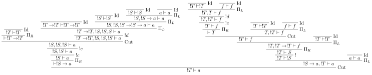

Reduction
#########

Core
====

Stroscot takes after Haskell in that all of the language is compiled to a smallish core language. Considerations:

* Based on :cite:`downenSequentCalculusCompiler2016a`, we use the full two-sided sequent calculus with cuts instead of an intuitionistic or one-sided calculus.
* Based on optimal reduction, mostly :cite:`guerriniTheoreticalPracticalIssues1996`, we use linear logic sequents, with operators for contraction (duplication) and weakening (erasing).
* Based on :cite:`levyJumboLCalculus2006`, we aim for the largest allowable set of operators. In particular we generalize all of the different operators into two jumbo operators, sigma and pi. :math:`\Sigma` contains LL's synchronous/positive operators 0, 1, plus ⊕, and times ⊗. :math:`\Pi` contains LL's lollipop implication ⊸ and asynchronous/negative operators top ⊤, bottom ⊥, with &, and par ⅋.

We start with the generalized :math:`\Pi` rule. This is similar to Levy's rule except it allows multiple conclusions. We have indexed variables :math:`A_{ij}` and :math:`B_{ik}` where :math:`0 \leq i < N, 0 \leq j < m_i, 0 \leq k < n_i`. We call :math:`N` the length of the jumbo type and the list :math:`(m_i,n_i)` the jumbo-arity.

.. math::

    \newcommand{\rule}[3]{ \dfrac{\displaystyle ~~#1~~ }{\displaystyle ~~#2~~ } \  (#3)}
    \begin{array}{cc}
    \rule{\overrightarrow{ \Gamma, \overrightarrow{A_{i j}} \vdash \overrightarrow{B_{i k}}, \Delta }}
      {\Gamma \vdash \prod \limits_{i} \left(\overrightarrow{A_i} \multimap \overrightarrow{B_i}\right), \Delta }
      {\Pi_R}
    &
    \rule{\overrightarrow{ \Gamma_j \vdash A_{i j}, \Delta_j } \quad \overrightarrow{ \Theta_k, B_{i k} \vdash \Lambda_k }}
      {\overrightarrow{\Gamma}, \vec \Theta, \prod \limits_{i} \left(\overrightarrow{A_i} \multimap \overrightarrow{B_i}\right) \vdash \overrightarrow{\Delta}, \vec\Lambda}
      {\Pi_{i} {}_{L}}
    \end{array}

Next we have the generalized :math:`\Sigma` rule. This allows premises as well. Following :cite:`wadlerCallbyvalueDualCallbyname2003` :cite:`crolardFormulaeasTypesInterpretationSubtractive2004` the dual of implication is called "subtraction" or "difference" and is denoted :math:`-`. For normal ADTs, the RHS of the difference is empty, i.e. it looks like :math:`A - []`. Ideally the difference operator allows creating zippers, or maybe it is useless.

.. math::

    \begin{array}{cc}
    \rule{\overrightarrow{ \Gamma_k, B_{i k} \vdash \Delta_k } \quad \overrightarrow{ \Theta_j \vdash A_{i j}, \Lambda_j } }
      {\overrightarrow{\Gamma}, \overrightarrow{\Theta} \vdash \sum \limits_{i} \left( \overrightarrow{A_i} - \overrightarrow{B_i} \right), \overrightarrow{\Delta}, \overrightarrow{\Lambda}}
      {\Sigma_{i} {}_{R}}
    &
    \rule{\overrightarrow{ \Gamma, \overrightarrow{A_{i j}} \vdash \overrightarrow{B_{i k}}, \Delta } }
      {\Gamma, \sum \limits_{i} \left ( \overrightarrow{A_i} - \overrightarrow{B_i} \right ) \vdash \Delta }
      {\Sigma_L}
    \end{array}

To allow/restrict contraction and weakening we have two S4 modalities, bang/!/"of course" and whim/whimper/?/"why not". A call-by-value function type is ``A -o ?B`` while call-by-name is ``!A -o B``. To enforce the S4 rules we add a level index to every term, as in :cite:`martiniFineStructureExponential1995` and :cite:`guerriniTheoreticalPracticalIssues1996`. The level of a context is the maximum of the levels of its terms (0 or negative infinity if empty). As a notational convention, the indices are omitted when they are all the same, i.e. in all the rules besides promotion and dereliction. Normally promotion has :math:`j=i+1` instead of :math:`j>i`, shrug.

.. math::

    \begin{array}{cccc}
      \rule{!\Gamma^i \vdash A^j, ?\Delta^i }{!\Gamma^i \vdash !A^i, ?\Delta^i}{!}_{j > i}
      & \rule{\Gamma^i, A^i \vdash \Delta^i }{\Gamma^i, !A^j \vdash \Delta^i}{!d}_{j\leq i}
      & \rule{\Gamma, !A, !A \vdash \Delta }{\Gamma, !A \vdash \Delta}{!c}
      & \rule{\Gamma \vdash \Delta }{\Gamma, !A \vdash \Delta}{!w}
    \end{array}

.. math::

    \begin{array}{cccc}
      \rule{!\Gamma^i, A^j \vdash ?\Delta^i }{!\Gamma^i, ?A^i \vdash ?\Delta^i}{?}_{j > i}
      & \rule{\Gamma^i \vdash A^i, \Delta^i }{\Gamma^i \vdash ?A^j, \Delta^i}{?d}_{j \leq i}
      & \rule{\Gamma \vdash ?A, ?A, \Delta }{\Gamma \vdash ?A, \Delta}{?c}
      & \rule{\Gamma \vdash \Delta }{\Gamma \vdash ?A, \Delta}{?w}
    \end{array}

To handle level mismatches we might also need lifting operators. The conditions are unclear.

.. math::

    \begin{array}{cc}
      \rule{\Gamma^i \vdash A^j, \Delta^i }{\Gamma^i \vdash A^i, \Delta^i}{\text{lift}_R}_{j > i}
      &
      \rule{\Gamma^i, A^j \vdash \Delta^i }{\Gamma^i, A^i \vdash \Delta^i}{\text{lift}_L}_{j > i}
    \end{array}

There are also quantifier rules, probably unnecessary but I'll write them down for reference. For these :math:`x` must have no free occurrence in :math:`\Gamma` or :math:`\Delta`, while :math:`y` may occur. :math:`A[t/x]` stands for the formula :math:`A` where all free occurrences of the variable :math:`x` have been replaced by the formula/term :math:`t` (and bound variables have been renamed when necessary).

.. math::

    \begin{array}{cccc}
      \rule{\Gamma \vdash A, \Delta}{\Gamma \vdash \forall x. A, \Delta}{\forall_R}
      &
      \rule{\Gamma, A[t/x] \vdash \Delta}{\Gamma, \forall x. A \vdash \Delta}{\forall_L}
      &
      \rule{\Gamma \vdash A[t/x], \Delta}{\Gamma \vdash \exists x. A, \Delta}{\exists_R}
      &
      \rule{\Gamma, A \vdash \Delta}{\Gamma, \exists x. A \vdash \Delta}{\exists_L}
    \end{array}

Finally we have the structural rules. Exchange isn't necessary because we assume multisets of formulas.

.. math::

    \begin{array}{cccc}
      \rule{}{A \vdash A}{\text{id}}
      &
      \rule{\Gamma \vdash A, \Delta \quad \Theta, A \vdash \Lambda }{\Gamma, \Theta \vdash \Delta, \Lambda }{\text{cut}}
      &
      \rule{\Gamma \vdash \Delta, A, B, \Theta}{\Gamma \vdash \Delta, B, A, \Theta}{\text{x}_R}
      &
      \rule{\Gamma, A, B, \Delta \vdash \Theta}{\Gamma, B, A, \Delta \vdash \Theta}{\text{x}_L}
    \end{array}

So in the end our propositions can be:

* A variable in the context
* Pi / Sigma
* A bang !A or whim ?A
* A forall or exists type, where the proposition is in the context extended by the variable

Syntax
======

Since proofs are programs by the Curry-Howard correspondence, we can use the rules as a programming language. But we need a syntax for it, since writing sequents all the time is tedious. The simplest, most explicit syntax enumerates the free variables (context/signature) of each sequent, all propositions, and all subderivations, for example ``Bang context Gamma Delta A subderivation``. But we can slim this down:

* The signature can be reconstructed by finding the free variables of the cedents (antecedent/succedent). We still need to add a type signature to each variable.
* The level indices can be recovered by a constraint solving (in particular a topological sort)
* The identified elements can be identified by variable names. Each variable occurs exactly twice. For identifying elements in the hypotheses we simple use the name, ``x``, ``y``, ``z``. For the conclusion, almost all the formulas have a single identified element in the conclusion, so we can use ``x = ...`` to identify it. For identity we assign names to both left and right, ``xl/xr = ...``.
* Gamma, delta, theta, and lambda can be inferred in most cases by taking the subderivations and removing the identified elements. Since they are unchanged we do not need to bind/rename the variables at all. For PiRight/SigmaLeft we do need to rename and combine gamma/delta from each case, similar to a phi-node, but this can be skipped if there's exactly one case. Also we need the context for ! / ?, so that the box is clearly defined and we can duplicate/erase it properly.
* Weakening and identity need a type argument ``T`` so we know the type of what's being introduced. Similarly the absurdity cases of PiRight/SigmaLeft (0 and top) need type annotations on Gamma/Delta. (But these can often be omitted/inferred like any other type signatures)
* For tags we use ``^i``, because Levy's notation ``#i`` is interpreted as a comment
* To handle top-level variables we introduce a Root derivation for the start of the tree

::

  x/[Gamma_m]/[Delta_n] = PiRight
    ^i, [A_ij],[B_ik],[Gamma_mi],[Delta_ni] -> subderivation_i
  x = PiLeft ^i [(Ai_j,left_subderivation_j)] [(Bi_k,right_subderivation_k)]
  x = SigmaRight ^i [(Bi_k,left_subderivation_k)] [(Ai_j,right_subderivation_k)]
  x/[Gamma_m]/[Delta_n] = SigmaLeft
    ^i, [A_ij],[B_ik],[Gamma_mi],[Delta_ni] -> subderivation_i
  x/[Gamma_m]/[Delta_n] = Bang A [Gamma_m]/[Delta_n] subderivation
  x = BangD A subderivation
  x = BangC A A subderivation
  x = BangW subderivation : T
  x/[Gamma_m]/[Delta_n] = Whim A [Gamma_m]/[Delta_n] subderivation
  x = WhimD A subderivation
  x = WhimC A A subderivation
  x = WhimW subderivation : T
  x = LiftRight A subderivation
  x = LiftLeft A subderivation
  l/r = Identity : T
  Cut Ar subderivation_right Al subderivation_left
  Root [a_i] [b_i] subderivation

Example
=======

So let's look at a simple program, boolean "and":

::

  and = \x -> case x of { False -> \_ -> False; True -> \y -> y }
  and False True : Bool

We define the types :math:`\text{B} = \Sigma [(F,[],[]),(T,[],[])]` and :math:`a \to b = \Pi [(\text{func}, [a], [b])]`. :math:`\to` is right associative as usual. Our program then has the following derivation tree, among others (we could add a bang to the first argument, use a multiple-argument function, expand out the identity, etc.).

.. image:: _static/Stroscot_AND_Proof_Tree.svg
.. LaTeX Source is same path .tex (paste into Overleaf, pdf2svg)

Next is Core. We start with the rules, then assign variable names (alphabetically), then fill in the arguments, to obtain:

::

  Root pr
    Cut a n
      a/[]/[] = Bang b []/[] (b = SigmaRight ^True [] [])
      Cut lr m
        Cut c k
          c = SigmaRight ^False [] []
          Cut d j
            d/[]/[] = PiRight ^func, [e], [f], [], [] ->
              e/[]/[f] = SigmaLeft
                ^False, [], [], [], [f1] ->
                  f1/[]/[] = PiRight ^func, [g1], [h1], [], [] ->
                    g1 = BangW (h1 = SigmaRight ^False [] [])
                  }
                ^True, [], [], [], [f2] ->
                  f2/[]/[] = PiRight ^func, [g2], [h2r], [], [] ->
                    g2 = BangD h2 (h2/h2r = Identity Bool)
            j = PiLeft ^func [(kr, k/kr = Identity)] [(l, l/lr = Identity)]
        m = PiLeft ^func [(nr, n/nr = Identity)] [(p, p/pr = Identity)]

Nets
====

As a description the syntax is fine, but it suffers from what Girard calls "the bureaucracy of syntax". For example the cuts ``Cut a n`` and ``Cut lr m`` and the associated ``a``/``m`` can be swapped without changing the meaning. In fact, for computation, we do not need the syntactic subderivation inclusion relationship at all, only the variables. Furthermore, since each variable appears exactly twice, we can replace all the rule instances with nodes and variables with connecting edges. We thus obtain a graph, similar to a proof net / interaction net:

.. graphviz::

  digraph {
  Root -> c1 [style=invis]
  c1 -> c2 [style=invis]
  c2 -> c3 [style=invis]
  c3 -> c4 [style=invis]

  Root -> p /* pr */ [color="red"]
  c1 [label="Cut"]
  c1 -> a [color="red"]
  c1 -> n [color="blue"]
  a [label="!"]
  a -> b [color="red"]
  b [label="True"]
  c2 [label="Cut"]
  c2 -> l /* lr */ [color="red"]
  c2 -> m [color="blue"]
  c3 [label="Cut"]
  c3 -> c [color="red"]
  c3 -> k [color="blue"]
  c [label="False"]
  c4 [label="Cut"]
  c4 -> d [color="red"]
  c4 -> j [color="blue"]
  d [label="PiR"]
  d -> e [color="blue"]
  d -> e /* f */ [color="red"]
  e [label="SigmaL"]
  e -> f1 [color="red"]
  e -> f2 [color="red"]
  f1 [label="PiR"]
  f1 -> g1 [color="blue"]
  f1 -> h1 [color="red"]
  g1 [label="!w"]
  h1 [label="False"]
  f2 [label="PiR"]
  f2 -> g2 [color="blue"]
  f2 -> h2 /* h2r */ [color="red"]
  g2 [label="!d"]
  g2 -> h2 [color="blue"]
  h2 [label="I"]
  j [label="PiL"]
  j -> k /* kr */ [color="red"]
  j -> l [color="blue"]
  k [label="I"]
  l [label="I"]
  m [label="PiL"]
  m -> n /* nr */ [color="red"]
  m -> p [color="blue"]
  n [label="I"]
  p [label="I"]
  }

Technically, the edges connect ports of nodes. The directionality and left=blue/right=red coloring is enough to identity the ports for the graph above, but disambiguating n-ary graphs in a clear way seems hard.

If we reverse the directions of the blue edges, then the graph is almost a tree, except for the backedges that can show up in PiRight/SigmaLeft.

Cut elimination
===============

For all reductions:

* Move the two nodes of the cut next to the cut with copy-paste

Identity

* Copy the cut's non-identity edge to the non-cut edge that links to the identity node. If the cut has levels then label with (id edge)->(non-id edge).
* Delete cut and identity

Matching left/right Pi/Sigma

* Erase non-matching cases, if any
* Link context variables of matching case with outside variables, if any
* Nodes should have same # of edges. Create cut nodes for each edge-pair.
* Link cut nodes with matching variable on each side.
* Preserve cut's level numbers (but not active status) for red-red, swap for red-blue
* Delete PiR/PiL nodes

Promotion/contraction

* Create duplication nodes for each out-edge of promotion, color=red/blue
* Link duplication nodes, if multiple
* Duplicate !p node and point to duplication node, marking one with arrowhead
* Duplicate cut and point to each side of contraction + !p nodes
* Create new contraction node for each context variable pointing to the two !p's
* Change references to !p to references to context contraction nodes
* Delete original !c contraction node

Promotion/Dereliction

* Replace cut's blue edge with edge of dereliction
* Move level on cut's red edge to cut's blue edge, if not set
* Replace cut's red edge with red edge of promotion
* For each context edge going into !p, replace edge with !p's edge
* Delete dereliction and promotion

Duplication:

* Duplicate node
* Create duplication node for each out-edge of node, copying edge from node
* Point each copy's edge to duplication node
* Add arrowheads to one of the copy's edges (higher number)
* Change dup node's references to point to node copies, deleting arrowheads & using to disambiguate
* Link duplication nodes / fix links

Multi-node Duplication:

* Duplicate nodes & rename
* Fixup node copies to point within themselves
* Create duplication node for each non-active out-edge of node, copying edge from node
* Replace each copy's non-active edges with edge to duplication node.
* Remove arrowheads from first copy's non-active edges. Add arrowheads to second copy set's non-active edges.
* Change dup node's references to point to node copies, deleting arrowheads & using arrowheads to disambiguate
* Link duplication nodes / fix links

Dup-Id-Dup:

* Duplicate identity node
* Replace references to dup nodes with identity reference (odot=higher)
* Delete duplication nodes and links

* For !w/?w we delete the rule with ! and create no cuts.
* To eliminate :math:`\forall` or :math:`\exists`, we extend the variable substitution to the other side.
* The commuting cases are mostly handled by our graph formalism; cuts on the context are pushed down to where they apply. But for PiRight/SigmaLeft there can be a cut on the context variables. To push it down we need to duplicate the cut and its other side for each case. Of course, if there are only 0/1 cases, there is no duplication. But in general we need to introduce a phi-duplication node; when the phi-dup node encounters an identity it adds the edge from the other side to the context variables. Overall commuting deletes code or exposes more reduction opportunities. There is also the potential to reverse-commute and deduplicate part of the cases, if they are the same.
* To expand identities, start with PiRight/SigmaLeft, then use the opposite rule on the opposite side for each case, and terminate with identities. But actually we should prefer to contract identities, searching for expanded identities and replacing them with identities on larger types.

Normal Order Reduction
======================

Looking at the graph for our simple ``and False True`` example we can see the general pattern for reduction, at least normal-order leftmost-outermost WHNF reduction. We start at the root and go down. The first node we encounter is not a data node SigmaRight / PiRight / etc. (we would stop with WHNF), instead it is an identity node. Since there is only one root node, the highest parent of the other side of the identity must be a cut node (unless the root node has a blue input edge). We then reduce this cut node. In this case it disappears and we move up to the PiL-PiR cut node. Here we create two cut nodes, one cuts the PiL near the root and the output of the SigmaL while the other cuts Id-Cut-False and the input of the SigmaL. The cut on the output of the SigmaL is blocked, so we go up the input of the SigmaL and our reduction stack looks like Root -> I -> PiL -> Cut -> SigmaL -> Cut. First we cut the Id and then we cut False-SigmaL. This selects the left PiR with !w/False for our output. We cut this with the PiL with !True, creating a disconnected cut between !True and !w (that is immediately erased) and another cut between our result and the root identity node. We erase the identity and end with our result False.

So the general pattern is, go down red / go up blue until you get to a redex (cut node, dup node with target covered)

Optimal reduction
=================

Optimal reduction ensures the minimal amount of cut elimination (reduction) steps. It's basically normal order, but we have to be careful to avoid duplicating cuts. See the example.

Primitives
==========

Primitives can be handled by hacking special cases into Cut; we add primitive functions of type PiR that use the arguments provided by PiL during a cut, and also literals, special values of type SigmaR.

For example, the term ``F2 G2 = (\x. x (\w. w) x x) (\y. (\x. x x) (y z))`` from page 17 of :cite:`aspertiOptimalImplementationFunctional1999`. To write the derivation tree we must define a recursive type; the simplest is :math:`\Omega = \, !\Omega \to \Omega` (which is sufficient for the untyped call-by-name lambda calculus) but here we use the mutually recursive types :math:`S,T,f` parametrized over :math:`a` to obtain a finer scheme and make the derivation tree less ambiguous.

.. math::

   S &= \, \left(!T \to !T \right) \to f

   T &= \, !T \to f

   f &= \, !S \to !S \to a

.. math::

   F2 &: \, !S \to a

   G2 &: \, !T \to S

::

  Root z ret
    Cut f2r f2l
      f2r/[]/[] = PiRight ^func, [x_f2], [ret_f2], [], [] ->
        x_f2 = BangC x1_f2 x23_f2
          x23_f2 = BangC x2_f2 x3_f2
            Cut id_r id_l
              id_r/[]/[] = PiRight ^func, [al], [ar], [], [] ->
                al/ar = Identity
              x1_f2 = BangD x1i_f2
                x1i_f2 = PiLeft ^func [(id_r2, id_l/id_r2 = Identity)] [(ssa,
                  ssa = PiLeft ^func [(x2r_f2, x2_f2/x2r_f2 = Identity)] [(sa,
                    sa = PiLeft ^func [(x3r_f2, x3_f2/x3r_f2 = Identity)] [(a1, a1/ret_f2 = Identity)])])]
      f2l = PiLeft ^func [(g2,
        g2 = Bang g2s
          g2s/[]/[] = PiRight ^func, [y], [ret_g2], [], [] ->
            y = PiLeft ^func [(y_arg,
              Cut o o_app
                o/[]/[] = PiRight ^func, [x_g2], [ret_o], [], [] ->
                  x_g2 = BangC x1_g2 x2_g2
                    x1_g2 = BangD x1i_g2
                      x1i_g2 = PiLeft ^func [(x2r_g2, x2_g2/x2r_g2 = Identity Bool)] [(f, f/ret_o = Identity)]
                o_app = PiLeft ^func [(tr, y_arg/tr = Identity)] [(f, f/ret_g2 = Identity)]
            )] [(zr, z/zr = Identity)]
      )] [(a2, a2/ret = Identity)]

.. graphviz::

  digraph {

  Root -> c1 [style=invis]
  y -> c2 [style=invis]
  x23_f2 -> c3 [style=invis]

  Root -> ret [color="red"]

  c1 [label="Cut"]
  c1 -> f2r [color="red"]
  c1 -> f2l [color="blue"]

  f2r [label="PiR"]
  f2r -> x_f2 [color="blue"]
  f2r -> ret_f2 [color="red"]

  x_f2 [label="!c"]
  x_f2 -> x1_f2 [color="blue"]
  x_f2 -> x23_f2 [color="blue"]

  x23_f2 [label="!c"]
  x23_f2 -> x2_f2 [color="blue"]
  x23_f2 -> x3_f2 [color="blue"]

  c2 [label="Cut"]
  c2 -> id_r [color="red"]
  c2 -> id_l [color="blue"]

  id_r [label="PiR"]
  id_r -> al [color="blue"]
  id_r -> al /* ar */ [color="red"]

  al [label="I"]

  x1_f2 [label="!d"]
  x1_f2 -> x1i_f2 [color="blue"]

  x1i_f2 [label="PiL"]
  x1i_f2 -> id_l /* id_r2 */ [color="red"]
  x1i_f2 -> ssa [color="blue"]

  id_l [label="I"]

  ssa [label="PiL"]
  ssa -> x2_f2 /* x2r_f2 */ [color="red"]
  ssa -> sa [color="blue"]

  x2_f2 [label="I"]

  sa [label="PiL"]
  sa -> x3_f2 /* x3r_f2 */ [color="red"]
  sa -> ret_f2 /* a1 */ [color="blue"]

  x3_f2 [label="I"]
  ret_f2  [label="I"]

  f2l [label="PiL"]
  f2l -> g2 [color="red"]
  f2l -> ret /* a2 */ [color="blue"]

  ret [label="I"]

  g2 [label="!"]
  g2 -> g2s [color="red"]

  g2s [label="PiR"]
  g2s -> y [color="blue"]
  g2s -> ret_g2 [color="red"]

  y [label="PiL"]
  y -> y_arg [color="blue"]
  Root -> y /* z/zr */ [dir="back"] [color="red"]

  c3 [label="Cut"]
  c3 -> o [color="red"]
  c3 -> o_app [color="blue"]

  o [label="PiR"]
  o -> x_g2 [color="blue"]
  o -> ret_o [color="red"]

  x_g2 [label="!c"]
  x_g2 -> x1_g2 [color="blue"]
  x_g2 -> x2_g2 [color="blue"]

  x1_g2 [label="!d"]
  x1_g2 -> x1i_g2 [color="blue"]

  x1i_g2 [label="PiL"]
  x1i_g2 -> x2_g2 /* x2r_g2 */ [color="red"]
  x1i_g2 -> ret_o /* f */ [color="blue"]

  x2_g2 [label="I"]
  ret_o [label="I"]

  o_app [label="PiL"]
  o_app -> y_arg /* tr */ [color="red"]
  o_app -> ret_g2 /* f */ [color="blue"]

  y_arg [label="I"]
  ret_g2 [label="I"]

  }

We want this to reduce without duplicating a cut. So first we reduce everything except the contraction:

.. graphviz::

  digraph {

  Root -> ret [color="red"]

  c2 [label="Cut"]
  c2 -> x_f2 [color="blue"]
  c2 -> g2 [color="red"]

  x_f2 [label="!c"]
  x_f2 -> x1_f2 [color="blue"]
  x_f2 -> x23_f2 [color="blue"]

  x23_f2 [label="!c"]
  x23_f2 -> x2_f2 [color="blue"]
  x23_f2 -> x3_f2 [color="blue"]

  id_r [label="PiR"]
  id_r -> al [color="blue"]
  id_r -> al /* ar */ [color="red"]

  al [label="I"]

  x1_f2 [label="!d"]
  x1_f2 -> x1i_f2 [color="blue"]

  x1i_f2 [label="PiL"]
  x1i_f2 -> id_r [color="red"]
  x1i_f2 -> ssa [color="blue"]

  ssa [label="PiL"]
  ssa -> x2_f2 /* x2r_f2 */ [color="red"]
  ssa -> sa [color="blue"]

  x2_f2 [label="I"]

  sa [label="PiL"]
  sa -> x3_f2 /* x3r_f2 */ [color="red"]
  sa -> ret /* a2 */ [color="blue"]

  x3_f2 [label="I"]
  ret [label="I"]

  g2 [label="!"]
  g2 -> g2s [color="red"]

  g2s [label="PiR"]
  g2s -> y [color="blue"]
  g2s -> ret_g2 [color="red"]

  y [label="PiL"]
  y -> x_g2 [color="blue"]
  Root -> y /* z/zr */ [dir="back"] [color="red"]

  x_g2 [label="!c"]
  x_g2 -> x1_g2 [color="blue"]
  x_g2 -> x2_g2 [color="blue"]

  x1_g2 [label="!d"]
  x1_g2 -> x1i_g2 [color="blue"]

  x1i_g2 [label="PiL"]
  x1i_g2 -> x2_g2 /* x2r_g2 */ [color="red"]
  x1i_g2 -> ret_g2 /* f */ [color="blue"]

  x2_g2 [label="I"]

  ret_g2 [label="I"]

  }

Next we move the !c over to a duplication node:

.. graphviz::

  digraph {

  Root -> ret [color="red"]

  c2 [label="Cut"]
  c2 -> x23_f2 [color="blue"]
  c2 -> d1 [color="red"]

  c1 [label="Cut"]
  c1 -> x1_f2 [color="blue"]
  c1 -> d1 [color="red"]

  d1 [label="Dup"]
  d1 -> g2 [color="red"]

  x23_f2 [label="!c"]
  x23_f2 -> x2_f2 [color="blue"]
  x23_f2 -> x3_f2 [color="blue"]

  id_r [label="PiR"]
  id_r -> al [color="blue"]
  id_r -> al /* ar */ [color="red"]

  al [label="I"]

  x1_f2 [label="!d"]
  x1_f2 -> x1i_f2 [color="blue"]

  x1i_f2 [label="PiL"]
  x1i_f2 -> id_r [color="red"]
  x1i_f2 -> ssa [color="blue"]

  ssa [label="PiL"]
  ssa -> x2_f2 /* x2r_f2 */ [color="red"]
  ssa -> sa [color="blue"]

  x2_f2 [label="I"]

  sa [label="PiL"]
  sa -> x3_f2 /* x3r_f2 */ [color="red"]
  sa -> ret /* a2 */ [color="blue"]

  x3_f2 [label="I"]
  ret [label="I"]

  g2 [label="!"]
  g2 -> g2s [color="red"]

  g2s [label="PiR"]
  g2s -> y [color="blue"]
  g2s -> ret_g2 [color="red"]

  y [label="PiL"]
  y -> x_g2 [color="blue"]
  Root -> y /* z/zr */ [dir="back"] [color="red"]

  x_g2 [label="!c"]
  x_g2 -> x1_g2 [color="blue"]
  x_g2 -> x2_g2 [color="blue"]

  x1_g2 [label="!d"]
  x1_g2 -> x1i_g2 [color="blue"]

  x1i_g2 [label="PiL"]
  x1i_g2 -> x2_g2 /* x2r_g2 */ [color="red"]
  x1i_g2 -> ret_g2 /* f */ [color="blue"]

  x2_g2 [label="I"]

  ret_g2 [label="I"]

  }

Then we incrementally move the duplication node down and do cut elimination:

.. graphviz::

  digraph {

  Root -> ret [color="red"]

  c2 [label="Cut"]
  c2 -> x23_f2 [color="blue"]
  c2 -> g2b [color="red"]

  c1 [label="Cut"]
  c1 -> x1i_f2 [color="blue"]
  c1 -> d1 [color="red"]

  d1 [label="Dup"]
  d1 -> g2s [color="red"]

  x23_f2 [label="!c"]
  x23_f2 -> x2_f2 [color="blue"]
  x23_f2 -> x3_f2 [color="blue"]

  id_r [label="PiR"]
  id_r -> al [color="blue"]
  id_r -> al /* ar */ [color="red"]

  al [label="I"]

  x1i_f2 [label="PiL"]
  x1i_f2 -> id_r [color="red"]
  x1i_f2 -> ssa [color="blue"]

  ssa [label="PiL"]
  ssa -> x2_f2 /* x2r_f2 */ [color="red"]
  ssa -> sa [color="blue"]

  x2_f2 [label="I"]

  sa [label="PiL"]
  sa -> x3_f2 /* x3r_f2 */ [color="red"]
  sa -> ret /* a2 */ [color="blue"]

  x3_f2 [label="I"]
  ret [label="I"]

  g2b [label="!"]
  g2b -> d1 [color="red"]

  g2s [label="PiR"]
  g2s -> y [color="blue"]
  g2s -> ret_g2 [color="red"]

  y [label="PiL"]
  y -> x_g2 [color="blue"]
  Root -> y /* z/zr */ [dir="back"] [color="red"]

  x_g2 [label="!c"]
  x_g2 -> x1_g2 [color="blue"]
  x_g2 -> x2_g2 [color="blue"]

  x1_g2 [label="!d"]
  x1_g2 -> x1i_g2 [color="blue"]

  x1i_g2 [label="PiL"]
  x1i_g2 -> x2_g2 /* x2r_g2 */ [color="red"]
  x1i_g2 -> ret_g2 /* f */ [color="blue"]

  x2_g2 [label="I"]

  ret_g2 [label="I"]

  }

.. graphviz::

  digraph {

  Root -> ret [color="red"]

  c1 [label="Cut"]
  c1 -> x1i_f2 [color="blue"]
  c1 -> d1 [color="red"]

  d1 [label="Dup"]
  d1 -> g2s [color="red"]

  d2 [label="Dup"]
  d2 -> d1 [color="red"]

  g2a [label="!"]
  g2a -> d2 [color="red"]

  g2b [label="!"]
  g2b -> d2 [color="red"]

  id_r [label="PiR"]
  id_r -> al [color="blue"]
  id_r -> al /* ar */ [color="red"]

  al [label="I"]

  x1i_f2 [label="PiL"]
  x1i_f2 -> id_r [color="red"]
  x1i_f2 -> ssa [color="blue"]

  ssa [label="PiL"]
  ssa -> g2a [color="red"]
  ssa -> sa [color="blue"]

  sa [label="PiL"]
  sa -> g2b [color="red"]
  sa -> ret /* a2 */ [color="blue"]

  ret [label="I"]

  g2s [label="PiR"]
  g2s -> y [color="blue"]
  g2s -> ret_g2 [color="red"]

  y [label="PiL"]
  y -> x_g2 [color="blue"]
  Root -> y /* z/zr */ [dir="back"] [color="red"]

  x_g2 [label="!c"]
  x_g2 -> x1_g2 [color="blue"]
  x_g2 -> x2_g2 [color="blue"]

  x1_g2 [label="!d"]
  x1_g2 -> x1i_g2 [color="blue"]

  x1i_g2 [label="PiL"]
  x1i_g2 -> x2_g2 /* x2r_g2 */ [color="red"]
  x1i_g2 -> ret_g2 /* f */ [color="blue"]

  x2_g2 [label="I"]

  ret_g2 [label="I"]

  }

.. graphviz::

  digraph {

  Root -> ret [color="red"]

  c1 [label="Cut"]
  c1 -> x1i_f2 [color="blue"]
  c1 -> g2sb [color="red"]

  d2 [label="Dup"]
  d2 -> g2sa [color="red"]

  g2a [label="!"]
  g2a -> d2 [color="red"]

  g2b [label="!"]
  g2b -> d2 [color="red"]

  id_r [label="PiR"]
  id_r -> al [color="blue"]
  id_r -> al /* ar */ [color="red"]

  al [label="I"]

  x1i_f2 [label="PiL"]
  x1i_f2 -> id_r [color="red"]
  x1i_f2 -> ssa [color="blue"]

  ssa [label="PiL"]
  ssa -> g2a [color="red"]
  ssa -> sa [color="blue"]

  sa [label="PiL"]
  sa -> g2b [color="red"]
  sa -> ret /* a2 */ [color="blue"]

  ret [label="I"]

  dy [label="Dup"]
  dy -> y [color="blue"]

  dr [label="Dup"]
  dr -> ret_g2 [color="red"]

  g2sa [label="PiR"]
  g2sa -> dy [color="blue"]
  g2sa -> dr [color="red"]

  g2sb [label="PiR"]
  g2sb -> dy [color="blue"]
  g2sb -> dr [color="red"]

  y [label="PiL"]
  y -> x_g2 [color="blue"]
  Root -> y /* z/zr */ [dir="back"] [color="red"]

  x_g2 [label="!c"]
  x_g2 -> x1_g2 [color="blue"]
  x_g2 -> x2_g2 [color="blue"]

  x1_g2 [label="!d"]
  x1_g2 -> x1i_g2 [color="blue"]

  x1i_g2 [label="PiL"]
  x1i_g2 -> x2_g2 /* x2r_g2 */ [color="red"]
  x1i_g2 -> ret_g2 /* f */ [color="blue"]

  x2_g2 [label="I"]

  ret_g2 [label="I"]

  }

.. graphviz::

  digraph {

  Root -> ret [color="red"]

  c1 [label="Cut"]
  c1 -> x1i_f2 [color="blue"]
  c1 -> g2sb [color="red"]

  d2 [label="Dup"]
  d2 -> g2sa [color="red"]

  g2a [label="!"]
  g2a -> d2 [color="red"]

  g2b [label="!"]
  g2b -> d2 [color="red"]

  id_r [label="PiR"]
  id_r -> al [color="blue"]
  id_r -> al /* ar */ [color="red"]

  al [label="I"]

  x1i_f2 [label="PiL"]
  x1i_f2 -> id_r [color="red"]
  x1i_f2 -> ssa [color="blue"]

  ssa [label="PiL"]
  ssa -> g2a [color="red"]
  ssa -> sa [color="blue"]

  sa [label="PiL"]
  sa -> g2b [color="red"]
  sa -> ret /* a2 */ [color="blue"]

  ret [label="I"]

  dy [label="Dup"]
  dy -> y [color="blue"]

  dr [label="Dup"]
  dr -> ret_g2 [color="red"]

  g2sa [label="PiR"]
  g2sa -> dy [color="blue"]
  g2sa -> dr [color="red"]

  g2sb [label="PiR"]
  g2sb -> dy [color="blue"]
  g2sb -> dr [color="red"]

  y [label="PiL"]
  y -> x_g2 [color="blue"]
  Root -> y /* z/zr */ [dir="back"] [color="red"]

  x_g2 [label="!c"]
  x_g2 -> x1_g2 [color="blue"]
  x_g2 -> x2_g2 [color="blue"]

  x1_g2 [label="!d"]
  x1_g2 -> x1i_g2 [color="blue"]

  x1i_g2 [label="PiL"]
  x1i_g2 -> x2_g2 /* x2r_g2 */ [color="red"]
  x1i_g2 -> ret_g2 /* f */ [color="blue"]

  x2_g2 [label="I"]

  ret_g2 [label="I"]

  }

Random old junk
###############

Linear logic
============

Linear logic has boxes,  The difference is not observable if we do not use duplication; e.g. ``(\x.print(x+1)) (print("x"); 2)`` can only print ``x3``. But if we change ``x+1`` to ``x+x`` then CBV is ``x4`` while CBN is ``xx4``.

So how do we specify the difference between the two, in linear logic?

::

  s x =
    (y,z) = dup x
    print(y+z)
  s (print("x"); 2)

Boxes do have some performance cost, so how can they be avoided? There are cases where boxes are not necessary:

1. When the term is linear or affine and does not need to duplicate anything.
2. When the duplication is duplication of a graph without any cuts, such as a boolean, integer, list of integers, etc. Even when there are cuts, the value can be forced and then copied directly, using a fold. (per :cite:`filinskiLinearContinuations1992`) Q: Does this change the evaluation semantics to be stricter?
3. Inlining, when the duplication is carried out, resulting in two terms.
4. More complex cases enforced by a typing system, such as Elementary Affine Logic.

Recursion
=========

Sequent Core :cite:`downenSequentCalculusCompiler2016a` also introduces two more rules "multicut" and "rec" that are illogical but computationally useful:

.. math::

    \begin{array}{cc}
      \rule
        {\Gamma, \Theta \vdash \Delta, \Lambda \quad \Gamma', \Lambda \vdash \Theta, \Delta' }
        {\Gamma, \Gamma' \vdash \Delta, \Delta' }{\text{multicut}}
      &
      \rule
        { \overrightarrow{\Gamma, \vec \Lambda, \Theta_i \vdash \Lambda_i, \vec \Theta, \Delta }}
        {\Gamma, \overrightarrow{\Theta_i} \vdash \overrightarrow{\Lambda_i}, \Delta }{\text{rec}}
    \end{array}

These probably aren't needed, as let can be encoded as a record and recursion via a fixed-point combinator or a cycle in the graph. In particular :cite:`kiselyovManyFacesFixedpoint2013` outline a polyvariadic combinator:

::

  fix_poly fl = fix (\self -> map ($ self) fl)

To implement ``fix`` we can use the variant of the Y combinator :math:`\lambda f.(\lambda x.x x) (\lambda x.f (x x))`. To type it we need the cyclic/recursive type :math:`Wr = \Pi[(^w, Wr, r)]` (in the sense of an infinite, regular tree). Though, once we have recursive types, we could allow recursive proof trees as well; then implementing recursion directly is probably not too hard. BOHM uses a fan/duplication node combined with a loop.

Optimal reduction
=================

In call-by-value reduction, work is duplicated quite frequently. And lazy or call-by-need reduction, although more efficient computation-wise than call-by-value, still duplicates work. An example is

::

  import System.IO.Unsafe
  i = \w -> (unsafePerformIO (print "i")) `seq` w
  z = 2 :: Integer
  t = 3 :: Integer
  f = \x -> (x z) + (x t)
  main = print (f (\y -> i y) :: Integer)

This produces ``5`` in Haskell. However, without GHC's optimizations, ``"i"`` is evaluated (printed) twice. With optimal reduction, all function applications with known arguments are evaluated exactly once. In particular, the only time a function is evaluated twice is when it is called with different arguments. In the example above it corresponds to a "hoisting" transformation that makes ``i = (unsafePerformIO (print "i")) `seq` \w -> w``, but more complex cases have higher-level sharing that no code transformation can mimic.

Although GHC will do this with ``-O``, it does it messily; the interaction of ``seq`` and inlining is the source of `numerous bugs <https://gitlab.haskell.org/ghc/ghc/issues/2273>`__. In contrast, optimal reduction is based on a principled approach to sharing. The graph corresponds almost exactly to linear logic proof nets. Also, since the sharing is part of the reduction semantics rather than a compiler optimization, it is available in the interpreter (and in the runtime system too). There are no thunks, so there is no need for ``seq``; instead there are boxes and duplicators.

Implementation
==============

Reduction is fairly simple to implement without duplication, as it is just pairs of constructors and destructors annihilating and joining their wires, or, for ``case``, joining some eraser nodes. But what about duplication?

Stroscot takes its general inspiration from the delimiter system found in Lambdascope. However, instead of having levels Stroscot keeps explicit track of "environments" or "scopes". In particular a delimiter has an inside scope and an outside scope. Initially, all delimiters look like opening/closing delimiters where the outside scope is the default/root scope ``0`` and the inside scope is the scope of the multiplexer involved. When two delimiters meet, the touching outer scopes are compared for equality (they should always be equal) and one inner scope remains the inner scope while the other inner scope become the new delimiter's outer scope.

To determine which scope becomes the outer scope, delimiters are also marked as "head", "full", or "empty" depending on whether they represent a reference to the result of a duplication, the target of a duplication, or a path that crosses the scope but doesn't duplicate. Interactions are allowed only between head delimiters and other delimiter; the head delimiter's scope stays on the inside.

For multiplexers the situation is a little more complicated. A multiplexer also has two scopes, an inner "label"/identity-like scope and an outer "ambient" scope. When a multiplexer crosses a delimiter, from outside to inside, its "ambient" scope is changed to the delimiter's inside scope. Meanwhile the delimiter's scope is split into a new set of scopes, and this is indexed by the label scope. In the Stroscot code these are referred to as "variant" scopes. In particular, multiplexers with the same label scope must split other scopes into the same set of variant scopes at each interaction. This is not too hard to keep track of, just give each scope a map ``other scope -> variant scope set`` that's lazily created.

Readback
~~~~~~~~

The real hard part is doing "readback", i.e. proving that all of these transformations are either no-ops on the original lambda term or valid beta reductions. Since there is so much scope popping and pushing and varianting it is definitely a little complex. Also I decided to keep the levels from the original Lambdascope implementation for correctness verification purposes, so there is twice the work. But if you read Ian Mackie's paper on efficient interaction nets implementation you will see that this "readback" algorithm also provides a way to directly execute the proof net / graph with call-by-value semantics at each reduction step. So it also has a close connection with how to compile the graph to machine code. Since our scopes are unique and the "stack" stores only one director index for a scope at a time, the scopes can correspond directly to machine registers or memory locations.

Scopes are nested, forming a simple tree hierarchy. When an opening head delimiter of scope A encounters a closing full or empty delimiter of scope B, then A is reparented under B. In particular the one closing delimiter of scope B vanishes, and duplicates of it are propagated to the outside of all other delimiters of A.

It should be possible to avoid this ``O(n)`` operation by keeping a depth counter in the scope and each delimiter, with the total number of scopes that the delimiter enters/exit being the sum of the scope's depth and the delimiter's depth. Then the interaction would decrement the A scope delimiter's local depth counter by 1, increment A's scope-wide depth counter by 1, and vanish B's delimiter as before. But this hasn't been implemented yet.

First we reduce the top cut:

.. graphviz::

  digraph {
  Root -> c1a
  Root -> c1b
  f -> c2
  h_di -> c3

  Root -> ret [color="red",penwidth=2]

  c1a [label="Cut"]
  c1a -> ret_o1 [color="red"]
  c1a -> ret [color="blue"]

  c1b [label="Cut"]
  c1b -> fp [color="red",label="0"]
  c1b -> x_o1 [color="blue"]

  x_o1 [label="!c"]
  x_o1 -> x1_o1 [color="blue"]
  x_o1 -> x2_o1 [color="blue"]

  x2_o1 [label="!d"]
  x2_o1 -> x2i_o1 [color="blue"]

  x2i_o1 [label="PiL"]
  x2i_o1 -> x1_o1 /* x1_o1r */ [color="red"]
  x2i_o1 -> ret_o1 /* ret_o1l */ [color="blue"]

  fp [label="!p"]
  fp -> f [color="red",label="1"]

  f [label="PiR"]
  f -> hi_retp /* h_d */ [color="blue",label="1"]
  f -> f_ret [color="red"]

  c2 [label="Cut",shape=doublecircle]
  c2 -> o2 [color="red"]
  c2 -> o2l [color="blue"]

  o2 [label="PiR"]
  o2 -> x_o2 [color="blue"]
  o2 -> ret_o2 [color="red"]

  x_o2 [label="!c"]
  x_o2 -> x1_o2 [color="blue"]
  x_o2 -> x2_o2 [color="blue"]

  x2_o2 [label="!d"]
  x2_o2 -> x2i_o2 [color="blue"]

  x2i_o2 [label="PiL"]
  x2i_o2 -> x1_o2 /* x1_o2r */ [color="red"]
  x2i_o2 -> ret_o2 /* ret_o2l */ [color="blue"]

  o2l [label="PiL"]
  o2l -> hi_retp [color="red",label="1"]
  o2l -> f_ret /* f_retl */ [color="blue"]

  hi_retp [label="!p"]
  hi_retp -> hi_ret [color="red",label="2"]
  hi_retp -> h_di [color="blue",label="1"]

  h_di [label="!d"]
  h_di -> h [color="blue",label="2"]

  c3 [label="Cut"]
  c3 -> i [color="red",label="2"]
  c3 -> h_app [color="blue"]

  i [label="!p"]
  i -> i_i [color="red",label="3"]

  i_i [label="PiR"]
  i_i -> il [color="blue"]
  i_i -> i_ret [color="red"]

  il [label="!d"]
  il -> i_ret /* ild */ [color="blue"]

  h [label="PiL"]
  h -> h_app /* h_appr */ [color="red"]
  h -> hi_ret /* hi_retl */ [color="blue"]

  x1_o1 [label="I"]
  ret_o1 [label="I"]
  x1_o2 [label="I"]
  ret_o2 [label="I"]
  i_ret [label="I"]
  h_app [label="I"]
  hi_ret [label="I"]
  f_ret [label="I"]
  ret [label="I"]

  }

Next the other PiR-PiL cut:

.. graphviz::

  digraph {
  Root -> c1a
  Root -> c1b
  f -> c2a
  f -> c2b
  h_di -> c3

  Root -> ret [color="red",penwidth=2]

  c1a [label="Cut",shape=doublecircle]
  c1a -> ret_o1 [color="red"]
  c1a -> ret [color="blue"]

  c1b [label="Cut"]
  c1b -> fp [color="red",label="0"]
  c1b -> x_o1 [color="blue"]

  x_o1 [label="!c"]
  x_o1 -> x1_o1 [color="blue"]
  x_o1 -> x2_o1 [color="blue"]

  x2_o1 [label="!d"]
  x2_o1 -> x2i_o1 [color="blue"]

  x2i_o1 [label="PiL"]
  x2i_o1 -> x1_o1 /* x1_o1r */ [color="red"]
  x2i_o1 -> ret_o1 /* ret_o1l */ [color="blue"]

  fp [label="!p"]
  fp -> f [color="red",label="1"]

  f [label="PiR"]
  f -> hi_retp /* h_d */ [color="blue",label="1"]
  f -> f_ret [color="red"]

  c2a [label="Cut",shape=doublecircle]
  c2a -> ret_o2 [color="red"]
  c2a -> f_ret [color="blue"]

  c2b [label="Cut"]
  c2b -> hi_retp [color="red",label="1"]
  c2b -> x_o2 [color="blue",label="1"]

  x_o2 [label="!c"]
  x_o2 -> x1_o2 [color="blue"]
  x_o2 -> x2_o2 [color="blue"]

  x2_o2 [label="!d"]
  x2_o2 -> x2i_o2 [color="blue"]

  x2i_o2 [label="PiL"]
  x2i_o2 -> x1_o2 /* x1_o2r */ [color="red"]
  x2i_o2 -> ret_o2 /* ret_o2l */ [color="blue"]

  hi_retp [label="!p"]
  hi_retp -> hi_ret [color="red",label="2"]
  hi_retp -> h_di [color="blue",label="1"]

  h_di [label="!d"]
  h_di -> h [color="blue",label="2"]

  c3 [label="Cut",shape=doublecircle]
  c3 -> i [color="red",label="2"]
  c3 -> h_app [color="blue"]

  i [label="!p"]
  i -> i_i [color="red",label="3"]

  i_i [label="PiR"]
  i_i -> il [color="blue"]
  i_i -> i_ret [color="red"]

  il [label="!d"]
  il -> i_ret /* ild */ [color="blue"]

  h [label="PiL"]
  h -> h_app /* h_appr */ [color="red"]
  h -> hi_ret /* hi_retl */ [color="blue"]

  x1_o1 [label="I"]
  ret_o1 [label="I"]
  x1_o2 [label="I"]
  ret_o2 [label="I"]
  i_ret [label="I"]
  h_app [label="I"]
  hi_ret [label="I"]
  f_ret [label="I"]
  ret [label="I"]

  }

Then, to clean up the graph, the trivial cuts:

.. graphviz::

  digraph {
  Root -> c1b
  f -> c2b

  Root -> ret [color="red",penwidth=2]

  c1b [label="Cut",shape=doublecircle]
  c1b -> fp [color="red",label="0"]
  c1b -> x_o1 [color="blue"]

  x_o1 [label="!c"]
  x_o1 -> x1_o1 [color="blue"]
  x_o1 -> x2_o1 [color="blue"]

  x2_o1 [label="!d"]
  x2_o1 -> x2i_o1 [color="blue"]

  x2i_o1 [label="PiL"]
  x2i_o1 -> x1_o1 /* x1_o1r */ [color="red"]
  x2i_o1 -> ret [color="blue"]

  fp [label="!p"]
  fp -> f [color="red",label="1"]

  f [label="PiR"]
  f -> hi_retp /* h_d */ [color="blue",label="1"]
  f -> f_ret [color="red"]

  c2b [label="Cut"]
  c2b -> hi_retp [color="red",label="1"]
  c2b -> x_o2 [color="blue",label="1"]

  x_o2 [label="!c"]
  x_o2 -> x1_o2 [color="blue"]
  x_o2 -> x2_o2 [color="blue"]

  x2_o2 [label="!d"]
  x2_o2 -> x2i_o2 [color="blue"]

  x2i_o2 [label="PiL"]
  x2i_o2 -> x1_o2 /* x1_o2r */ [color="red"]
  x2i_o2 -> f_ret [color="blue"]

  hi_retp [label="!p"]
  hi_retp -> hi_ret [color="red",label="2"]
  hi_retp -> h_di [color="blue",label="1"]

  h_di [label="!d"]
  h_di -> h [color="blue",label="2"]

  i [label="!p"]
  i -> i_i [color="red",label="3"]

  i_i [label="PiR"]
  i_i -> il [color="blue"]
  i_i -> i_ret [color="red"]

  il [label="!d"]
  il -> i_ret /* ild */ [color="blue"]

  h [label="PiL"]
  h -> i [color="red",label="2"]
  h -> hi_ret /* hi_retl */ [color="blue"]

  x1_o1 [label="I"]
  x1_o2 [label="I"]
  i_ret [label="I"]
  hi_ret [label="I"]
  f_ret [label="I"]
  ret [label="I"]

  }

To handle the duplication from the contraction we duplicate the cuts/promotion rule and introduce a duplication node Dup to incrementally duplicate the rest of the structure:

.. graphviz::

  digraph {
  Root -> c1a
  Root -> c1b
  f -> c2b

  Root -> ret [color="red",penwidth=2]

  d1 [label="Dup"]
  d1 -> f [color="red"]

  c1a [label="Cut",shape=doublecircle]
  c1a -> fpa [color="red",label="0"]
  c1a -> x1_o1 [color="blue"]

  c1b [label="Cut",shape=doublecircle]
  c1b -> fpb [color="red",label="0"]
  c1b -> x2_o1 [color="blue"]

  x2_o1 [label="!d"]
  x2_o1 -> x2i_o1 [color="blue"]

  x2i_o1 [label="PiL"]
  x2i_o1 -> x1_o1 /* x1_o1r */ [color="red"]
  x2i_o1 -> ret [color="blue"]

  fpb [label="!p"]
  fpb -> d1 [color="red",label="1"]

  fpa [label="!p"]
  fpa -> d1 [color="red",arrowhead="odot",label="1"]

  f [label="PiR"]
  f -> hi_retp /* h_d */ [color="blue",label="1"]
  f -> f_ret [color="red"]

  c2b [label="Cut"]
  c2b -> hi_retp [color="red",label="1"]
  c2b -> x_o2 [color="blue",label="1"]

  x_o2 [label="!c"]
  x_o2 -> x1_o2 [color="blue"]
  x_o2 -> x2_o2 [color="blue"]

  x2_o2 [label="!d"]
  x2_o2 -> x2i_o2 [color="blue"]

  x2i_o2 [label="PiL"]
  x2i_o2 -> x1_o2 /* x1_o2r */ [color="red"]
  x2i_o2 -> f_ret [color="blue"]

  hi_retp [label="!p"]
  hi_retp -> hi_ret [color="red",label="2"]
  hi_retp -> h_di [color="blue",label="1"]

  h_di [label="!d"]
  h_di -> h [color="blue",label="2"]

  i [label="!p"]
  i -> i_i [color="red",label="3"]

  i_i [label="PiR"]
  i_i -> il [color="blue"]
  i_i -> i_ret [color="red"]

  il [label="!d"]
  il -> i_ret /* ild */ [color="blue"]

  h [label="PiL"]
  h -> i [color="red",label="2"]
  h -> hi_ret /* hi_retl */ [color="blue"]

  x1_o1 [label="I"]
  x1_o2 [label="I"]
  i_ret [label="I"]
  hi_ret [label="I"]
  f_ret [label="I"]
  ret [label="I"]

  }

Then we do cut elimination on what remains. Cut/id is trivial.

.. graphviz::

  digraph {
  Root -> c1b
  f -> c2b

  Root -> ret [color="red",penwidth=2]

  d1 [label="Dup",shape=doublecircle]
  d1 -> f [color="red"]

  c1b [label="Cut"]
  c1b -> d1 [color="red",label="1"]
  c1b -> x2i_o1 [color="blue",label="0"]

  x2i_o1 [label="PiL"]
  x2i_o1 -> fpa [color="red",label="0"]
  x2i_o1 -> ret [color="blue"]

  fpa [label="!p"]
  fpa -> d1 [color="red",arrowhead="odot",label="1"]

  f [label="PiR"]
  f -> hi_retp /* h_d */ [color="blue",label="1"]
  f -> f_ret [color="red"]

  c2b [label="Cut"]
  c2b -> hi_retp [color="red",label="1"]
  c2b -> x_o2 [color="blue",label="1"]

  x_o2 [label="!c"]
  x_o2 -> x1_o2 [color="blue"]
  x_o2 -> x2_o2 [color="blue"]

  x2_o2 [label="!d"]
  x2_o2 -> x2i_o2 [color="blue"]

  x2i_o2 [label="PiL"]
  x2i_o2 -> x1_o2 /* x1_o2r */ [color="red"]
  x2i_o2 -> f_ret [color="blue"]

  hi_retp [label="!p"]
  hi_retp -> hi_ret [color="red",label="2"]
  hi_retp -> h_di [color="blue",label="1"]

  h_di [label="!d"]
  h_di -> h [color="blue",label="2"]

  i [label="!p"]
  i -> i_i [color="red",label="3"]

  i_i [label="PiR"]
  i_i -> il [color="blue"]
  i_i -> i_ret [color="red"]

  il [label="!d"]
  il -> i_ret /* ild */ [color="blue"]

  h [label="PiL"]
  h -> i [color="red",label="2"]
  h -> hi_ret /* hi_retl */ [color="blue"]

  x1_o2 [label="I"]
  i_ret [label="I"]
  hi_ret [label="I"]
  f_ret [label="I"]
  ret [label="I"]

  }

.. graphviz::

  digraph {
  Root -> c1b
  fa -> c2b
  fb -> c2b
  d1 -> d2 [dir=none,style=dashed,constraint=false]

  Root -> ret [color="red",penwidth=2]

  d1 [label="Dup"]
  d1 -> f_ret [color="red"]

  d2 [label="Dup"]
  d2 -> hi_retp /* h_d */ [color="blue",label="1"]

  c1b [label="Cut",shape=doublecircle]
  c1b -> fb [color="red",label="1"]
  c1b -> x2i_o1 [color="blue",label="0"]

  x2i_o1 [label="PiL"]
  x2i_o1 -> fpa [color="red",label="0"]
  x2i_o1 -> ret [color="blue"]

  fpa [label="!p"]
  fpa -> fa [color="red",label="1"]

  fa [label="PiR"]
  fa -> d2 [color="blue",arrowhead="odot"]
  fa -> d1 [color="red",arrowhead="odot"]

  fb [label="PiR"]
  fb -> d2 [color="blue"]
  fb -> d1 [color="red"]

  c2b [label="Cut"]
  c2b -> hi_retp [color="red",label="1"]
  c2b -> x_o2 [color="blue",label="1"]

  x_o2 [label="!c"]
  x_o2 -> x1_o2 [color="blue"]
  x_o2 -> x2_o2 [color="blue"]

  x2_o2 [label="!d"]
  x2_o2 -> x2i_o2 [color="blue"]

  x2i_o2 [label="PiL"]
  x2i_o2 -> x1_o2 /* x1_o2r */ [color="red"]
  x2i_o2 -> f_ret [color="blue"]

  hi_retp [label="!p"]
  hi_retp -> hi_ret [color="red",label="2"]
  hi_retp -> h_di [color="blue",label="1"]

  h_di [label="!d"]
  h_di -> h [color="blue",label="2"]

  i [label="!p"]
  i -> i_i [color="red",label="3"]

  i_i [label="PiR"]
  i_i -> il [color="blue"]
  i_i -> i_ret [color="red"]

  il [label="!d"]
  il -> i_ret /* ild */ [color="blue"]

  h [label="PiL"]
  h -> i [color="red",label="2"]
  h -> hi_ret /* hi_retl */ [color="blue"]

  x1_o2 [label="I"]
  i_ret [label="I"]
  hi_ret [label="I"]
  f_ret [label="I"]
  ret [label="I"]

  }

Then the 3rd PiL-PiR cut / beta reduction, corresponding to Fig 2.14 (4) / (5) on page 31 of :cite:`aspertiOptimalImplementationFunctional1999`:

.. graphviz::

  digraph {
  Root -> c1a
  Root -> c1b
  fa -> c2b
  c1b -> c2b
  d1 -> d2 [dir=none,style=dashed,constraint=false]

  Root -> ret [color="red",penwidth=2]

  d1 [label="Dup"]
  d1 -> f_ret [color="red"]

  d2 [label="Dup"]
  d2 -> hi_retp /* h_d */ [color="blue",label="1"]

  c1a [label="Cut",shape=doublecircle]
  c1a -> d1 [color="red",label="1"]
  c1a -> ret [color="blue",label="0"]

  c1b [label="Cut"]
  c1b -> fpa [color="red",label="0"]
  c1b -> d2 [color="blue",label="1"]

  fpa [label="!p"]
  fpa -> fa [color="red",label="1"]

  fa [label="PiR"]
  fa -> d2 [color="blue",arrowhead="odot"]
  fa -> d1 [color="red",arrowhead="odot"]

  c2b [label="Cut"]
  c2b -> hi_retp [color="red",label="1"]
  c2b -> x_o2 [color="blue",label="1"]

  x_o2 [label="!c"]
  x_o2 -> x1_o2 [color="blue"]
  x_o2 -> x2_o2 [color="blue"]

  x2_o2 [label="!d"]
  x2_o2 -> x2i_o2 [color="blue"]

  x2i_o2 [label="PiL"]
  x2i_o2 -> x1_o2 /* x1_o2r */ [color="red"]
  x2i_o2 -> f_ret [color="blue"]

  hi_retp [label="!p"]
  hi_retp -> hi_ret [color="red",label="2"]
  hi_retp -> h_di [color="blue",label="1"]

  h_di [label="!d"]
  h_di -> h [color="blue",label="2"]

  i [label="!p"]
  i -> i_i [color="red",label="3"]

  i_i [label="PiR"]
  i_i -> il [color="blue"]
  i_i -> i_ret [color="red"]

  il [label="!d"]
  il -> i_ret /* ild */ [color="blue"]

  h [label="PiL"]
  h -> i [color="red",label="2"]
  h -> hi_ret /* hi_retl */ [color="blue"]

  x1_o2 [label="I"]
  i_ret [label="I"]
  hi_ret [label="I"]
  f_ret [label="I"]
  ret [label="I"]

  }

.. graphviz::

  digraph {
  Root -> c1b
  fa -> c2b
  c1b -> c2b
  d1 -> d2 [dir=none,style=dashed,constraint=false]

  Root -> d1 [color="red",label="0->1"]

  d1 [label="Dup"]
  d1 -> f_ret [color="red"]

  d2 [label="Dup"]
  d2 -> hi_retp /* h_d */ [color="blue",label="1"]

  c1b [label="Cut"]
  c1b -> fpa [color="red",label="0"]
  c1b -> d2 [color="blue",label="1"]

  fpa [label="!p"]
  fpa -> fa [color="red",label="1"]

  fa [label="PiR"]
  fa -> d2 [color="blue",arrowhead="odot"]
  fa -> d1 [color="red",arrowhead="odot"]

  c2b [label="Cut",shape=doublecircle]
  c2b -> hi_retp [color="red",label="1"]
  c2b -> x_o2 [color="blue",label="1"]

  x_o2 [label="!c"]
  x_o2 -> x1_o2 [color="blue"]
  x_o2 -> x2_o2 [color="blue"]

  x2_o2 [label="!d"]
  x2_o2 -> x2i_o2 [color="blue"]

  x2i_o2 [label="PiL"]
  x2i_o2 -> x1_o2 /* x1_o2r */ [color="red"]
  x2i_o2 -> f_ret [color="blue"]

  hi_retp [label="!p"]
  hi_retp -> hi_ret [color="red",label="2"]
  hi_retp -> h_di [color="blue",label="1"]

  h_di [label="!d"]
  h_di -> h [color="blue",label="2"]

  i [label="!p"]
  i -> i_i [color="red",label="3"]

  i_i [label="PiR"]
  i_i -> il [color="blue"]
  i_i -> i_ret [color="red"]

  il [label="!d"]
  il -> i_ret /* ild */ [color="blue"]

  h [label="PiL"]
  h -> i [color="red",label="2"]
  h -> hi_ret /* hi_retl */ [color="blue"]

  x1_o2 [label="I"]
  i_ret [label="I"]
  hi_ret [label="I"]
  f_ret [label="I"]

  }

At this stage we can't duplicate any more because of the !p box. So we do the other cut.

.. graphviz::

  digraph {
  Root -> c1b
  fa -> c2b
  c1b -> c2b
  fa -> c2a
  c1b -> c2a
  d1 -> d2 [dir=none,style=dashed,constraint=false]
  d3 -> d4 [dir=none,style=dashed,constraint=false]

  Root -> d1 [color="red",label="0->1"]

  d1 [label="Dup"]
  d1 -> f_ret [color="red"]

  d2 [label="Dup"]
  d2 -> hi_retpc [color="blue"]

  hi_retpc [label="!c"]
  hi_retpc -> hi_retpa [color="blue",label="1"]
  hi_retpc -> hi_retpb [color="blue",label="1"]

  c1b [label="Cut"]
  c1b -> fpa [color="red",label="0"]
  c1b -> d2 [color="blue",label="1"]

  fpa [label="!p"]
  fpa -> fa [color="red",label="1"]

  fa [label="PiR"]
  fa -> d2 [color="blue",arrowhead="odot"]
  fa -> d1 [color="red",arrowhead="odot"]

  c2a [label="Cut",shape=doublecircle]
  c2a -> hi_retpa [color="red",label="1"]
  c2a -> x1_o2 [color="blue",label="1"]

  c2b [label="Cut",shape=doublecircle]
  c2b -> hi_retpb [color="red",label="1"]
  c2b -> x2_o2 [color="blue",label="1"]

  x2_o2 [label="!d"]
  x2_o2 -> x2i_o2 [color="blue"]

  x2i_o2 [label="PiL"]
  x2i_o2 -> x1_o2 /* x1_o2r */ [color="red"]
  x2i_o2 -> f_ret [color="blue"]

  hi_retpb [label="!p"]
  hi_retpb -> d3 [color="red",label="2"]
  hi_retpb -> d4 [color="blue",label="1"]

  hi_retpa [label="!p"]
  hi_retpa -> d3 [color="red",label="2",arrowhead="odot"]
  hi_retpa -> d4 [color="blue",label="1",arrowhead="odot"]

  d3 [label="Dup"]
  d3 -> hi_ret [color="red"]

  d4 [label="Dup"]
  d4 -> h_di [color="blue",label="1"]

  h_di [label="!d"]
  h_di -> h [color="blue",label="2"]

  i [label="!p"]
  i -> i_i [color="red",label="3"]

  i_i [label="PiR"]
  i_i -> il [color="blue"]
  i_i -> i_ret [color="red"]

  il [label="!d"]
  il -> i_ret /* ild */ [color="blue"]

  h [label="PiL"]
  h -> i [color="red",label="2"]
  h -> hi_ret /* hi_retl */ [color="blue"]

  x1_o2 [label="I"]
  i_ret [label="I"]
  hi_ret [label="I"]
  f_ret [label="I"]

  }

.. graphviz::

  digraph {
  Root -> c1b
  fa -> c2b
  c1b -> c2b
  d1 -> d2 [dir=none,style=dashed,constraint=false]
  d3 -> d4 [dir=none,style=dashed,constraint=false]

  Root -> d1 [color="red",label="0->1"]

  d1 [label="Dup"]
  d1 -> f_ret [color="red"]

  d2 [label="Dup",shape=doublecircle]
  d2 -> hi_retpc [color="blue"]

  hi_retpc [label="!c"]
  hi_retpc -> hi_retpa [color="blue",label="1"]
  hi_retpc -> d4 [color="blue"]

  c1b [label="Cut"]
  c1b -> fpa [color="red",label="0"]
  c1b -> d2 [color="blue",label="1"]

  fpa [label="!p"]
  fpa -> fa [color="red",label="1"]

  fa [label="PiR"]
  fa -> d2 [color="blue",arrowhead="odot"]
  fa -> d1 [color="red",arrowhead="odot"]

  c2b [label="Cut"]
  c2b -> d3 [color="red",label="2"]
  c2b -> x2i_o2 [color="blue",label="1"]

  x2i_o2 [label="PiL"]
  x2i_o2 -> hi_retpa [color="red",label="1"]
  x2i_o2 -> f_ret [color="blue"]

  hi_retpa [label="!p"]
  hi_retpa -> d3 [color="red",label="2",arrowhead="odot"]
  hi_retpa -> d4 [color="blue",label="1",arrowhead="odot"]

  d3 [label="Dup"]
  d3 -> hi_ret [color="red"]

  d4 [label="Dup"]
  d4 -> h_di [color="blue",label="1"]

  h_di [label="!d"]
  h_di -> h [color="blue",label="2"]

  i [label="!p"]
  i -> i_i [color="red",label="3"]

  i_i [label="PiR"]
  i_i -> il [color="blue"]
  i_i -> i_ret [color="red"]

  il [label="!d"]
  il -> i_ret /* ild */ [color="blue"]

  h [label="PiL"]
  h -> i [color="red",label="2"]
  h -> hi_ret /* hi_retl */ [color="blue"]

  i_ret [label="I"]
  hi_ret [label="I"]
  f_ret [label="I"]

  }

The !c is exposed so we can create another duplication.

.. graphviz::

  digraph {
  Root -> c1b
  fa -> c2b
  c1b -> c2b
  d1 -> d2b [dir=none,style=dashed,constraint=false]
  d2a -> d2b [dir=none,style=dashed,constraint=false]
  d3 -> d4 [dir=none,style=dashed,constraint=false]

  Root -> d1 [color="red",label="0->1"]

  d1 [label="Dup"]
  d1 -> f_ret [color="red"]

  d2a [label="Dup"]
  d2a -> hi_retpa [color="blue",label="1"]

  d2b [label="Dup"]
  d2b -> d4 [color="blue"]

  hi_retpc1 [label="!c"]
  hi_retpc1 -> d2a [color="blue",arrowhead=odot]
  hi_retpc1 -> d2b [color="blue",arrowhead=odot]

  hi_retpc2 [label="!c"]
  hi_retpc2 -> d2a [color="blue"]
  hi_retpc2 -> d2b [color="blue"]

  c1b [label="Cut",shape=doublecircle]
  c1b -> fpa [color="red",label="0"]
  c1b -> hi_retpc2 [color="blue",label="1"]

  fpa [label="!p"]
  fpa -> fa [color="red",label="1"]

  fa [label="PiR"]
  fa -> hi_retpc1 [color="blue"]
  fa -> d1 [color="red",arrowhead="odot"]

  c2b [label="Cut"]
  c2b -> d3 [color="red",label="2"]
  c2b -> x2i_o2 [color="blue",label="1"]

  x2i_o2 [label="PiL"]
  x2i_o2 -> hi_retpa [color="red",label="1"]
  x2i_o2 -> f_ret [color="blue"]

  hi_retpa [label="!p"]
  hi_retpa -> d3 [color="red",label="2",arrowhead="odot"]
  hi_retpa -> d4 [color="blue",label="1",arrowhead="odot"]

  d3 [label="Dup"]
  d3 -> hi_ret [color="red"]

  d4 [label="Dup"]
  d4 -> h_di [color="blue",label="1"]

  h_di [label="!d"]
  h_di -> h [color="blue",label="2"]

  i [label="!p"]
  i -> i_i [color="red",label="3"]

  i_i [label="PiR"]
  i_i -> il [color="blue"]
  i_i -> i_ret [color="red"]

  il [label="!d"]
  il -> i_ret /* ild */ [color="blue"]

  h [label="PiL"]
  h -> i [color="red",label="2"]
  h -> hi_ret /* hi_retl */ [color="blue"]

  i_ret [label="I"]
  hi_ret [label="I"]
  f_ret [label="I"]

  }

.. graphviz::

  digraph {
  Root -> c1a
  Root -> c1b
  fa -> c2b
  c1a -> c2b
  c1b -> c2b
  d1 -> d2a [dir=none,style=dashed,constraint=false]
  d1 -> d2b [dir=none,style=dashed,constraint=false]
  d3 -> d4 [dir=none,style=dashed,constraint=false]

  Root -> d1 [color="red",label="0->1"]

  d1 [label="Dup"]
  d1 -> f_ret [color="red"]

  d2a [label="Dup"]
  d2a -> hi_retpa [color="blue",label="1"]

  d2b [label="Dup"]
  d2b -> d4 [color="blue"]

  hi_retpc1 [label="!c"]
  hi_retpc1 -> d2a [color="blue",arrowhead=odot]
  hi_retpc1 -> d2b [color="blue",arrowhead=odot]

  c1a [label="Cut"]
  c1a -> fpa [color="red",label="0"]
  c1a -> d2a [color="blue",label="1"]

  c1b [label="Cut"]
  c1b -> fpb [color="red",label="0"]
  c1b -> d2b [color="blue",label="1"]

  fpa [label="!p"]
  fpa -> d5 [color="red",label="1"]

  fpb [label="!p"]
  fpb -> d5 [color="red",label="1"]

  d5 [label="Dup"]
  d5 -> fa [color="red"]

  fa [label="PiR"]
  fa -> hi_retpc1 [color="blue"]
  fa -> d1 [color="red",arrowhead="odot"]

  c2b [label="Cut"]
  c2b -> d3 [color="red",label="2"]
  c2b -> x2i_o2 [color="blue",label="1"]

  x2i_o2 [label="PiL"]
  x2i_o2 -> hi_retpa [color="red",label="1"]
  x2i_o2 -> f_ret [color="blue"]

  hi_retpa [label="!p"]
  hi_retpa -> d3 [color="red",label="2",arrowhead="odot"]
  hi_retpa -> d4 [color="blue",label="1",arrowhead="odot"]

  d3 [label="Dup"]
  d3 -> hi_ret [color="red"]

  d4 [label="Dup",shape=doublecircle]
  d4 -> h_di [color="blue",label="1"]

  h_di [label="!d"]
  h_di -> h [color="blue",label="2"]

  i [label="!p"]
  i -> i_i [color="red",label="3"]

  i_i [label="PiR"]
  i_i -> il [color="blue"]
  i_i -> i_ret [color="red"]

  il [label="!d"]
  il -> i_ret /* ild */ [color="blue"]

  h [label="PiL"]
  h -> i [color="red",label="2"]
  h -> hi_ret /* hi_retl */ [color="blue"]

  i_ret [label="I"]
  hi_ret [label="I"]
  f_ret [label="I"]

  }

More duplication

.. graphviz::

  digraph {
  Root -> c1a
  Root -> c1b
  fa -> c2b
  c1a -> c2b
  c1b -> c2b
  d1 -> d2a [dir=none,style=dashed,constraint=false]
  d1 -> d2b [dir=none,style=dashed,constraint=false]
  d3 -> d4 [dir=none,style=dashed,constraint=false]

  Root -> d1 [color="red",label="0->1"]

  d1 [label="Dup"]
  d1 -> f_ret [color="red"]

  d2a [label="Dup"]
  d2a -> hi_retpa [color="blue",label="1"]

  d2b [label="Dup"]
  d2b -> h_dib [color="blue",label="1"]

  hi_retpc1 [label="!c"]
  hi_retpc1 -> d2a [color="blue",arrowhead=odot]
  hi_retpc1 -> d2b [color="blue",arrowhead=odot]

  c1a [label="Cut"]
  c1a -> fpa [color="red",label="0"]
  c1a -> d2a [color="blue",label="1"]

  c1b [label="Cut"]
  c1b -> fpb [color="red",label="0"]
  c1b -> d2b [color="blue",label="1"]

  fpa [label="!p"]
  fpa -> d5 [color="red",label="1"]

  fpb [label="!p"]
  fpb -> d5 [color="red",label="1"]

  d5 [label="Dup"]
  d5 -> fa [color="red"]

  fa [label="PiR"]
  fa -> hi_retpc1 [color="blue"]
  fa -> d1 [color="red",arrowhead="odot"]

  c2b [label="Cut"]
  c2b -> d3 [color="red",label="2"]
  c2b -> x2i_o2 [color="blue",label="1"]

  x2i_o2 [label="PiL"]
  x2i_o2 -> hi_retpa [color="red",label="1"]
  x2i_o2 -> f_ret [color="blue"]

  hi_retpa [label="!p"]
  hi_retpa -> d3 [color="red",label="2",arrowhead="odot"]
  hi_retpa -> h_dia [color="blue",label="1",arrowhead="odot"]

  d3 [label="Dup"]
  d3 -> hi_ret [color="red"]

  d4 [label="Dup",shape=doublecircle]
  d4 -> h [color="blue"]

  h_dia [label="!d"]
  h_dia -> d4 [color="blue",label="2",arrowhead=odot]

  h_dib [label="!d"]
  h_dib -> d4 [color="blue",label="2"]

  i [label="!p"]
  i -> i_i [color="red",label="3"]

  i_i [label="PiR"]
  i_i -> il [color="blue"]
  i_i -> i_ret [color="red"]

  il [label="!d"]
  il -> i_ret /* ild */ [color="blue"]

  h [label="PiL"]
  h -> i [color="red",label="2"]
  h -> hi_ret /* hi_retl */ [color="blue"]

  i_ret [label="I"]
  hi_ret [label="I"]
  f_ret [label="I"]

  }

.. graphviz::

  digraph {
  Root -> c1a
  Root -> c1b
  fa -> c2b
  c1a -> c2b
  c1b -> c2b
  d1 -> d2a [dir=none,style=dashed,constraint=false]
  d1 -> d2b [dir=none,style=dashed,constraint=false]
  d3 -> d4a [dir=none,style=dashed,constraint=false]
  d4a -> d4b [dir=none,style=dashed,constraint=false]

  Root -> d1 [color="red",label="0->1"]

  d1 [label="Dup"]
  d1 -> f_ret [color="red"]

  d2a [label="Dup"]
  d2a -> hi_retpa [color="blue",label="1"]

  d2b [label="Dup"]
  d2b -> h_dib [color="blue",label="1"]

  hi_retpc1 [label="!c"]
  hi_retpc1 -> d2a [color="blue",arrowhead=odot]
  hi_retpc1 -> d2b [color="blue",arrowhead=odot]

  c1a [label="Cut"]
  c1a -> fpa [color="red",label="0"]
  c1a -> d2a [color="blue",label="1"]

  c1b [label="Cut"]
  c1b -> fpb [color="red",label="0"]
  c1b -> d2b [color="blue",label="1"]

  fpa [label="!p"]
  fpa -> d5 [color="red",label="1"]

  fpb [label="!p"]
  fpb -> d5 [color="red",label="1"]

  d5 [label="Dup"]
  d5 -> fa [color="red"]

  fa [label="PiR"]
  fa -> hi_retpc1 [color="blue"]
  fa -> d1 [color="red",arrowhead="odot"]

  c2b [label="Cut"]
  c2b -> d3 [color="red",label="2"]
  c2b -> x2i_o2 [color="blue",label="1"]

  x2i_o2 [label="PiL"]
  x2i_o2 -> hi_retpa [color="red",label="1"]
  x2i_o2 -> f_ret [color="blue"]

  hi_retpa [label="!p"]
  hi_retpa -> d3 [color="red",label="2",arrowhead="odot"]
  hi_retpa -> h_dia [color="blue",label="1",arrowhead="odot"]

  d3 [label="Dup",shape=doublecircle]
  d3 -> hi_ret [color="red"]

  d4a [label="Dup"]
  d4a -> i [color="red",label="2"]

  d4b [label="Dup",shape=doublecircle]
  d4b -> hi_ret /* hi_retl */ [color="blue"]

  h_dia [label="!d"]
  h_dia -> ha [color="blue",label="2"]

  h_dib [label="!d"]
  h_dib -> hb [color="blue",label="2"]

  i [label="!p"]
  i -> i_i [color="red",label="3"]

  i_i [label="PiR"]
  i_i -> il [color="blue"]
  i_i -> i_ret [color="red"]

  il [label="!d"]
  il -> i_ret /* ild */ [color="blue"]

  ha [label="PiL"]
  ha -> d4a [color="red",arrowhead=odot]
  ha -> d4b [color="blue",arrowhead=odot]

  hb [label="PiL"]
  hb -> d4a [color="red"]
  hb -> d4b [color="blue"]

  i_ret [label="I"]
  hi_ret [label="I",shape=doublecircle]
  f_ret [label="I"]

  }

Up until now we have avoided duplicating identity nodes; this is because duplicating an identity node from only one side would require creating an up-moving duplicator; since cuts reduce downwards this would break the reduction semantics and possibly lead to work duplication. But here we have duplicators on both sides of the identity node, and can duplicate it without reversing directions.

.. graphviz::

  digraph {
  Root -> c1a
  Root -> c1b
  fa -> c2b
  c1a -> c2b
  c1b -> c2b
  d1 -> d2a [dir=none,style=dashed,constraint=false]
  d1 -> d2b [dir=none,style=dashed,constraint=false]

  Root -> d1 [color="red",label="0->1"]

  d1 [label="Dup"]
  d1 -> f_ret [color="red"]

  d2a [label="Dup"]
  d2a -> hi_retpa [color="blue",label="1"]

  d2b [label="Dup"]
  d2b -> h_dib [color="blue",label="1"]

  hi_retpc1 [label="!c"]
  hi_retpc1 -> d2a [color="blue",arrowhead=odot]
  hi_retpc1 -> d2b [color="blue",arrowhead=odot]

  c1a [label="Cut"]
  c1a -> fpa [color="red",label="0"]
  c1a -> d2a [color="blue",label="1"]

  c1b [label="Cut"]
  c1b -> fpb [color="red",label="0"]
  c1b -> d2b [color="blue",label="1"]

  fpa [label="!p"]
  fpa -> d5 [color="red",label="1"]

  fpb [label="!p"]
  fpb -> d5 [color="red",label="1"]

  d5 [label="Dup"]
  d5 -> fa [color="red"]

  fa [label="PiR"]
  fa -> hi_retpc1 [color="blue"]
  fa -> d1 [color="red",arrowhead="odot"]

  c2b [label="Cut",shape=doublecircle]
  c2b -> hi_retb [color="red",label="2"]
  c2b -> x2i_o2 [color="blue",label="1"]

  x2i_o2 [label="PiL"]
  x2i_o2 -> hi_retpa [color="red",label="1"]
  x2i_o2 -> f_ret [color="blue"]

  hi_retpa [label="!p"]
  hi_retpa -> hi_reta [color="red",label="2"]
  hi_retpa -> h_dia [color="blue",label="1",arrowhead="odot"]

  d4a [label="Dup"]
  d4a -> i [color="red",label="2"]

  h_dia [label="!d"]
  h_dia -> ha [color="blue",label="2"]

  h_dib [label="!d"]
  h_dib -> hb [color="blue",label="2"]

  i [label="!p"]
  i -> i_i [color="red",label="3"]

  i_i [label="PiR"]
  i_i -> il [color="blue"]
  i_i -> i_ret [color="red"]

  il [label="!d"]
  il -> i_ret /* ild */ [color="blue"]

  ha [label="PiL"]
  ha -> d4a [color="red",arrowhead=odot]
  ha -> hi_reta [color="blue"]

  hb [label="PiL"]
  hb -> d4a [color="red"]
  hb -> hi_retb [color="blue"]

  i_ret [label="I"]
  hi_reta [label="I"]
  hi_retb [label="I"]
  f_ret [label="I"]

  }

.. graphviz::

  digraph {
  Root -> c1a
  Root -> c1b
  d1 -> d2a [dir=none,style=dashed,constraint=false]
  d1 -> d2b [dir=none,style=dashed,constraint=false]

  Root -> d1 [color="red",label="0->1"]

  d1 [label="Dup"]
  d1 -> f_ret [color="red"]

  d2a [label="Dup"]
  d2a -> hi_retpa [color="blue",label="1"]

  d2b [label="Dup"]
  d2b -> h_dib [color="blue",label="1"]

  hi_retpc1 [label="!c"]
  hi_retpc1 -> d2a [color="blue",arrowhead=odot]
  hi_retpc1 -> d2b [color="blue",arrowhead=odot]

  c1a [label="Cut"]
  c1a -> fpa [color="red",label="0"]
  c1a -> d2a [color="blue",label="1"]

  c1b [label="Cut"]
  c1b -> fpb [color="red",label="0"]
  c1b -> d2b [color="blue",label="1"]

  fpa [label="!p"]
  fpa -> d5 [color="red",label="1"]

  fpb [label="!p"]
  fpb -> d5 [color="red",label="1"]

  d5 [label="Dup"]
  d5 -> fa [color="red"]

  fa [label="PiR"]
  fa -> hi_retpc1 [color="blue"]
  fa -> d1 [color="red",arrowhead="odot"]

  x2i_o2 [label="PiL"]
  x2i_o2 -> hi_retpa [color="red",label="1"]
  x2i_o2 -> f_ret [color="blue"]

  hi_retpa [label="!p"]
  hi_retpa -> hi_reta [color="red",label="2"]
  hi_retpa -> h_dia [color="blue",label="1",arrowhead="odot"]

  d4a [label="Dup",shape=doublecircle]
  d4a -> i [color="red",label="2"]

  h_dia [label="!d"]
  h_dia -> ha [color="blue",label="2"]

  h_dib [label="!d"]
  h_dib -> hb [color="blue",label="2"]

  i [label="!p"]
  i -> i_i [color="red",label="3"]

  i_i [label="PiR"]
  i_i -> il [color="blue"]
  i_i -> i_ret [color="red"]

  il [label="!d"]
  il -> i_ret /* ild */ [color="blue"]

  ha [label="PiL"]
  ha -> d4a [color="red",arrowhead=odot]
  ha -> hi_reta [color="blue"]

  hb [label="PiL"]
  hb -> d4a [color="red"]
  hb -> x2i_o2 [color="blue",label="2->1"]

  i_ret [label="I"]
  hi_reta [label="I"]
  f_ret [label="I"]

  }

At this point we finish out the duplication of the identity function, similar to Fig 2.19(8).

.. graphviz::

  digraph {
  Root -> c1a
  Root -> c1b
  d1 -> d2a [dir=none,style=dashed,constraint=false]
  d1 -> d2b [dir=none,style=dashed,constraint=false]

  Root -> d1 [color="red",label="0->1"]

  d1 [label="Dup"]
  d1 -> f_ret [color="red"]

  d2a [label="Dup"]
  d2a -> hi_retpa [color="blue",label="1"]

  d2b [label="Dup",shape=doublecircle]
  d2b -> h_dib [color="blue",label="1"]

  hi_retpc1 [label="!c"]
  hi_retpc1 -> d2a [color="blue",arrowhead=odot]
  hi_retpc1 -> d2b [color="blue",arrowhead=odot]

  c1a [label="Cut"]
  c1a -> fpa [color="red",label="0"]
  c1a -> d2a [color="blue",label="1"]

  c1b [label="Cut"]
  c1b -> fpb [color="red",label="0"]
  c1b -> d2b [color="blue",label="1"]

  fpa [label="!p"]
  fpa -> d5 [color="red",label="1"]

  fpb [label="!p"]
  fpb -> d5 [color="red",label="1"]

  d5 [label="Dup"]
  d5 -> fa [color="red"]

  fa [label="PiR"]
  fa -> hi_retpc1 [color="blue"]
  fa -> d1 [color="red",arrowhead="odot"]

  x2i_o2 [label="PiL"]
  x2i_o2 -> hi_retpa [color="red",label="1"]
  x2i_o2 -> f_ret [color="blue"]

  hi_retpa [label="!p"]
  hi_retpa -> hi_reta [color="red",label="2"]
  hi_retpa -> h_dia [color="blue",label="1",arrowhead="odot"]

  h_dia [label="!d"]
  h_dia -> ha [color="blue",label="2"]

  h_dib [label="!d"]
  h_dib -> hb [color="blue",label="2"]

  ha [label="PiL"]
  ha -> i1 [color="red",label="2"]
  ha -> hi_reta [color="blue"]

  hb [label="PiL"]
  hb -> i2 [color="red",label="2"]
  hb -> x2i_o2 [color="blue",label="2->1"]

  hi_reta [label="I"]
  f_ret [label="I"]

  i1 [label="!p"]
  i1 -> i_i1 [color="red",label="3"]

  i_i1 [label="PiR"]
  i_i1 -> il1 [color="blue"]
  i_i1 -> i_ret1 [color="red"]

  il1 [label="!d"]
  il1 -> i_ret1 [color="blue"]

  i_ret1 [label="I"]

  i2 [label="!p"]
  i2 -> i_i2 [color="red",label="3"]

  i_i2 [label="PiR"]
  i_i2 -> il2 [color="blue"]
  i_i2 -> i_ret2 [color="red"]

  il2 [label="!d"]
  il2 -> i_ret2 [color="blue"]

  i_ret2 [label="I"]
  }

Now we can do the other duplication. Duplicating the !p requires all inputs to be covered. similar to identity nodes.

.. graphviz::

  digraph {
  Root -> c1a
  Root -> c1b
  d1 -> d2a [dir=none,style=dashed,constraint=false]
  d1 -> d2ba [dir=none,style=dashed,constraint=false]
  d1 -> d2bb [dir=none,style=dashed,constraint=false]

  Root -> d1 [color="red",label="0->1"]

  d1 [label="Dup",shape=doublecircle]
  d1 -> f_ret [color="red"]

  d2a [label="Dup"]
  d2a -> hi_retpa [color="blue",label="1"]

  h_dib1 [label="!d"]
  h_dib1 -> hb1 [color="blue",label="2"]

  h_dib2 [label="!d"]
  h_dib2 -> hb2 [color="blue",label="2"]

  hb1 [label="PiL"]
  hb1 -> i2a [color="red",label="2"]
  hb1 -> x2i_o2a [color="blue",label="2->1"]

  hb2 [label="PiL"]
  hb2 -> i2b [color="red",label="2"]
  hb2 -> x2i_o2b [color="blue",label="2->1"]

  i2a [label="!p"]
  i2a -> i_i2a [color="red",label="3"]

  i_i2a [label="PiR"]
  i_i2a -> il2a [color="blue"]
  i_i2a -> i_ret2a [color="red"]

  il2a [label="!d"]
  il2a -> i_ret2a [color="blue"]

  i_ret2a [label="I"]

  i2b [label="!p"]
  i2b -> i_i2b [color="red",label="3"]

  i_i2b [label="PiR"]
  i_i2b -> il2b [color="blue"]
  i_i2b -> i_ret2b [color="red"]

  il2b [label="!d"]
  il2b -> i_ret2b [color="blue"]

  i_ret2b [label="I"]

  d2ba [label="Dup"]
  d2ba -> hi_retpa [color="red",label="1"]

  d2bb [label="Dup",shape=doublecircle]
  d2bb -> f_ret [color="blue"]

  x2i_o2a [label="PiL"]
  x2i_o2a -> d2ba [color="red",arrowhead=odot]
  x2i_o2a -> d2bb [color="blue",arrowhead=odot]

  x2i_o2b [label="PiL"]
  x2i_o2b -> d2ba [color="red"]
  x2i_o2b -> d2bb [color="blue"]

  hi_retpc1 [label="!c"]
  hi_retpc1 -> d2a [color="blue",arrowhead=odot]
  hi_retpc1 -> h_dib1 [color="blue",label="1"]

  c1a [label="Cut"]
  c1a -> fpa [color="red",label="0"]
  c1a -> d2a [color="blue",label="1"]

  c1b [label="Cut"]
  c1b -> fpb [color="red",label="0"]
  c1b -> h_dib2 [color="blue",label="1"]

  fpa [label="!p"]
  fpa -> d5 [color="red",label="1"]

  fpb [label="!p"]
  fpb -> d5 [color="red",label="1"]

  d5 [label="Dup"]
  d5 -> fa [color="red"]

  fa [label="PiR"]
  fa -> hi_retpc1 [color="blue"]
  fa -> d1 [color="red",arrowhead="odot"]

  hi_retpa [label="!p"]
  hi_retpa -> hi_reta [color="red",label="2"]
  hi_retpa -> h_dia [color="blue",label="1",arrowhead="odot"]

  h_dia [label="!d"]
  h_dia -> ha [color="blue",label="2"]

  ha [label="PiL"]
  ha -> i1 [color="red",label="2"]
  ha -> hi_reta [color="blue"]

  hi_reta [label="I"]
  f_ret [label="I",shape=doublecircle]

  i1 [label="!p"]
  i1 -> i_i1 [color="red",label="3"]

  i_i1 [label="PiR"]
  i_i1 -> il1 [color="blue"]
  i_i1 -> i_ret1 [color="red"]

  il1 [label="!d"]
  il1 -> i_ret1 [color="blue"]

  i_ret1 [label="I"]

  }

.. graphviz::

  digraph {
  Root -> c1a
  Root -> c1b
  d2a -> d2ba [dir=none,style=dashed,constraint=false]

  Root -> f_ret1 [color="red",label="0->1"]

  f_ret1 [label="I"]
  f_ret2 [label="I"]

  d2a [label="Dup"]
  d2a -> hi_retpa [color="blue",label="1"]

  h_dib1 [label="!d"]
  h_dib1 -> hb1 [color="blue",label="2"]

  h_dib2 [label="!d"]
  h_dib2 -> hb2 [color="blue",label="2"]

  hb1 [label="PiL"]
  hb1 -> i2a [color="red",label="2"]
  hb1 -> x2i_o2a [color="blue",label="2->1"]

  hb2 [label="PiL"]
  hb2 -> i2b [color="red",label="2"]
  hb2 -> x2i_o2b [color="blue",label="2->1"]

  i2a [label="!p"]
  i2a -> i_i2a [color="red",label="3"]

  i_i2a [label="PiR"]
  i_i2a -> il2a [color="blue"]
  i_i2a -> i_ret2a [color="red"]

  il2a [label="!d"]
  il2a -> i_ret2a [color="blue"]

  i_ret2a [label="I"]

  i2b [label="!p"]
  i2b -> i_i2b [color="red",label="3"]

  i_i2b [label="PiR"]
  i_i2b -> il2b [color="blue"]
  i_i2b -> i_ret2b [color="red"]

  il2b [label="!d"]
  il2b -> i_ret2b [color="blue"]

  i_ret2b [label="I"]

  d2ba [label="Dup"]
  d2ba -> hi_retpa [color="red",label="1"]

  x2i_o2a [label="PiL"]
  x2i_o2a -> d2ba [color="red",arrowhead=odot]
  x2i_o2a -> f_ret2 [color="blue"]

  x2i_o2b [label="PiL"]
  x2i_o2b -> d2ba [color="red"]
  x2i_o2b -> f_ret1 [color="blue"]

  hi_retpc1 [label="!c"]
  hi_retpc1 -> d2a [color="blue",arrowhead=odot]
  hi_retpc1 -> h_dib1 [color="blue",label="1"]

  c1a [label="Cut"]
  c1a -> fpa [color="red",label="0"]
  c1a -> d2a [color="blue",label="1"]

  c1b [label="Cut"]
  c1b -> fpb [color="red",label="0"]
  c1b -> h_dib2 [color="blue",label="1"]

  fpa [label="!p"]
  fpa -> d5 [color="red",label="1"]

  fpb [label="!p"]
  fpb -> d5 [color="red",label="1"]

  d5 [label="Dup"]
  d5 -> fa [color="red"]

  fa [label="PiR"]
  fa -> hi_retpc1 [color="blue"]
  fa -> f_ret2 [color="red"]

  hi_retpa [label="!p"]
  hi_retpa -> hi_reta [color="red",label="2"]
  hi_retpa -> h_dia [color="blue",label="1",arrowhead="odot"]

  h_dia [label="!d"]
  h_dia -> ha [color="blue",label="2"]

  ha [label="PiL"]
  ha -> i1 [color="red",label="2"]
  ha -> hi_reta [color="blue"]

  hi_reta [label="I"]

  i1 [label="!p"]
  i1 -> i_i1 [color="red",label="3"]

  i_i1 [label="PiR"]
  i_i1 -> il1 [color="blue"]
  i_i1 -> i_ret1 [color="red"]

  il1 [label="!d"]
  il1 -> i_ret1 [color="blue"]

  i_ret1 [label="I"]

  }

Junk
====

Our 4th beta reduction

Duplicate more

Add the last duplication node and reduce, for consistency with figure 2.17 (7)

2.17(7) has 5 duplicator nodes, 3 app nodes, and 3 lambda nodes. In comparison, our graph has 5 duplicators, 4 cuts, 3 identities, and one each of PiL, PiR, !p, and !d. So there are still the two pairs of fans but the nodes otherwise look completely different.

Anyway, for the pair on the right, if we scroll up a bit we can see that we were duplicating a single PiR-!d-I loop, the identity function. So the duplication of the I must resolve to another identity function, with the two connecting.
